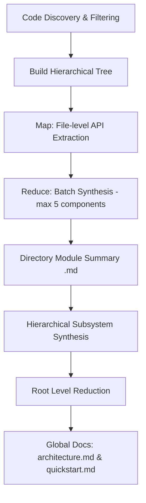

# Code-Reducer

**Code-Reducer** is a lightweight, high-performance command-line tool written in Go that automatically generates and maintains developer-friendly, comprehensive wikis for extensive repositories. 

Designed specifically for **local development and private LLMs**, Code-Reducer uses a custom **Hierarchical Map-Reduce Strategy** to analyze large codebases using small, local LLM models (e.g., 7B, 9B, or 26B parameters) via **Ollama** without exceeding context windows or degrading output quality.

---

## 🚀 Key Strengths

### 1. Hierarchical Map-Reduce Strategy
Standard LLMs fail when fed massive codebases due to context window limits, prompt dilution, and high token costs. Code-Reducer solves this by breaking codebase synthesis into a structured Map-Reduce pipeline:
- **Map Phase**: Extracts precise API signatures (exported functions, classes, interfaces, structures) and a one-sentence technical description for each source file.
- **Reduce Phase**: Recursively merges and synthesizes these summaries bottom-up through the folder structure in batches of 5 components, producing high-density directory-level module summaries.
- **Global Synthesis**: Synthesizes the root directory summary into `architecture.md` (overall system boundaries) and `quickstart.md` (developer-facing onboarding).

### 2. Tailored for Small, Local LLMs (Ollama)
Code-Reducer is optimized for local execution using Ollama:
- Generates high-quality documentation using small models (such as `ornith:9b` or `gemma4:26b-a4b-it-qat`).
- Avoids the need for expensive API subscriptions or sending proprietary code to third-party cloud LLM providers.

### 3. Enterprise-Grade Security & Concurrency Controls
- **Symlink & Path Traversal Prevention**: Resolves paths using a safe path traversal sanitizer (`SafeResolve`) that validates paths and ensures symlinks never point outside the repository boundaries (resolving symlinks recursively up to 32 levels deep).
- **Exclusive Process Locks**: Uses a file locking mechanism (`.code-reducer.lock` via `flock` and inode checks) to serialize operations, preventing file corruption from concurrent runs and protecting against TOCTOU symlink swap attacks.
- **Binary/Junk File Exclusion**: Employs null-byte file detection and extension blacklisting to prevent feeding large compiled assets, images, or compressed archives to the LLM.

---

## 🗺️ How the Map-Reduce Pipeline Works



---

## 📂 Example Output

You can inspect the actual documentation generated by Code-Reducer for this repository in the local [wiki/](file:///home/arrase/Develop/code-reducer/wiki) directory:

- **System Blueprint**: [wiki/architecture.md](file:///home/arrase/Develop/code-reducer/wiki/architecture.md) – A high-level architectural overview of the system, module relations, and boundaries.
- **Developer Quickstart**: [wiki/quickstart.md](file:///home/arrase/Develop/code-reducer/wiki/quickstart.md) – A quick onboarding guide with patterns, configuration rules, and setup steps.
- **Module Documentation**: Detailed technical specifications located in the [wiki/modules/](file:///home/arrase/Develop/code-reducer/wiki/modules) subdirectory:
  - [cmd.md](file:///home/arrase/Develop/code-reducer/wiki/modules/cmd.md) – CLI commands (`root`, `setup`, `init`, `update`).
  - [internal.md](file:///home/arrase/Develop/code-reducer/wiki/modules/internal.md) – Synthesis of core application library packages.
  - [internal_config.md](file:///home/arrase/Develop/code-reducer/wiki/modules/internal_config.md) – Configuration engine and environment management details.
  - [internal_engine.md](file:///home/arrase/Develop/code-reducer/wiki/modules/internal_engine.md) – Core Map-Reduce execution pipeline and LLM client logic.
  - [internal_security.md](file:///home/arrase/Develop/code-reducer/wiki/modules/internal_security.md) – Path traversal checks and flock-based concurrency controls.
  - [internal_tools.md](file:///home/arrase/Develop/code-reducer/wiki/modules/internal_tools.md) – Helper utilities for Git integration and directory/binary discovery.

---

## 🏗️ Technical Deep Dive

### 1. Security & Concurrency Sandbox

The codebase enforces absolute security when accessing local system paths and handling file descriptors.

#### Path Traversal Guard (`SafeResolve`)
Every filesystem operation targeting repository resources passes through `security.SafeResolve`.
1. **Directory Traversal Detection**: It computes the absolute path of the repository root, joins it with the input path, cleans it, and obtains the relative path. If the relative path starts with `..`, it immediately returns a path traversal error.
2. **Symlink Escape Mitigation**: To resolve symlinks safely—even for non-existent files that are about to be written—it climbs up the target path until it finds the closest directory that actually exists on disk.
3. **Recursive Resolution**: It resolves all symlinks recursively using `os.Readlink` up to a hard limit of `32` depth levels (to prevent infinite symlink loop denial-of-service). The resolved physical path is verified to lie inside the repository root.

#### Cross-Process Locking (`flock` & TOCTOU Defense)
To serialize execution across multiple terminal windows or cron jobs, the command engine invokes `security.AcquireLock` before starting the process:
1. **Flock Acquisition**: An exclusive flock is established on `.code-reducer.lock`.
2. **TOCTOU Symlink Hijacking Defense**: Opening the lockfile with write permissions is done without immediate truncation (`os.O_WRONLY|os.O_CREATE`). Truncating a path that has been swapped with a symlink targeting a system file (like `/etc/passwd`) would corrupt the system target before validation occurs.
3. **Verification**: After opening, it checks the path with `os.Lstat`. If it is a symlink, it aborts. It then checks the open file descriptor via `f.Stat()` and compares both using `os.SameFile()`. If the file descriptor inode does not match the path inode, a symlink replacement race is detected; the tool releases the lock and aborts execution.
4. **Safe Truncation**: Once validated, the file descriptor is truncated safely, and the current PID is written into the lockfile.
5. **Git Isolation**: The runner automatically checks if `.code-reducer.lock` is ignored. If not, it safely appends it to the project's `.gitignore` file.

---

### 2. Configuration Resolution Pipeline

Code-Reducer implements a four-tier configuration resolution chain in `internal/config/env.go`:

```
[1. CLI Overrides] ──► [2. Environment Variables] ──► [3. YAML Config File] ──► [4. System Defaults]
```

#### Precedence Order:
1. **CLI Flags**: `--model-id` and `--num-ctx` take absolute priority.
2. **Environment Variables**: `CODE_REDUCER_MODEL_ID`, `OLLAMA_BASE_URL`, and `OLLAMA_NUM_CTX` override file values.
3. **YAML File (`.code-reducer.yaml`)**: Read from the repository root.
4. **Defaults**: Hardcoded fallbacks (Model ID: `gemma4:26b-a4b-it-qat`, Ollama URL: `http://localhost:11434`, Context: `8192`).

#### Side-Effect Environmental Propagation
On resolution, tracing parameters (`LANGSMITH_API_KEY`, `LANGCHAIN_PROJECT`, `LANGCHAIN_TRACING_V2`) are injected into the active OS process environment via `os.Setenv`. This guarantees that downstream library clients (like LangChain/LangSmith tracing SDKs) capture and hook into active runs without introducing explicit imports or circular packages.

---

### 3. File Discovery, Binary, and Ignore Filters

Repository scanning is executed using `filepath.WalkDir` coupled with multiple layers of evaluation:
1. **Pruning Subtrees**: Common dependency, cache, and build directories (`.git`, `node_modules`, `bower_components`, `dist`, `build`, `cache`, `__pycache__`, `venv`, `.venv`, and directory names ending in `.egg-info`) are skipped using `filepath.SkipDir` at the walk root, saving CPU cycles.
2. **Ignore Matching Rules**: Ignores specified in the YAML configuration are resolved with `ShouldIgnorePath`. This evaluates four matching schemes:
   - **Exact Match**: The relative cleaned path matches the ignore pattern.
   - **Prefix Match**: The path resides within a subdirectory matching the ignore pattern.
   - **Component-Level Match**: A folder name anywhere in the path matches the pattern.
   - **Glob Match**: The pattern is evaluated using glob-style matching (`filepath.Match`).
3. **Binary Classification (Null-Byte Scanner)**: Files with blacklisted extensions (e.g. `.png`, `.pdf`, `.zip`, `.exe`, `.so`) or lockfile suffixes (`*-lock.json`, `pnpm-lock.yaml`) are ignored. Unlabelled binaries are caught by checking the first `1024` bytes for a null byte (`0x00`). If a null byte is found, the file is classified as a binary and skipped.

---

### 4. Git CLI Wrapper & Incremental Diff Engine

Instead of pulling massive git libraries, Code-Reducer implements a shell execution wrapper around the `git` binary:
- **`RunGit` Wrapper**: Commands are executed with the `--no-pager` option to prevent terminal blocking in headless and CI environments. Stdout and Stderr are captured and merged for detailed debugging.
- **Incremental Diff Parsing**: The engine executes `git diff --name-status <LastDocumentedCommit>` to identify modified, added, renamed, or deleted files. Untracked files are gathered via `git ls-files --others --exclude-standard`.
- **Rename & Copy Handling**: In `parseGitDiff`, renames (`R100`) and copies (`C100`) are decomposed into clean `Deleted` and `Added` status transitions, allowing the cache to clean up dead files and create updated entries.

---

### 5. Hierarchical Map-Reduce Engine

```
Code Files ──► [Map Phase] ──► File Facts ──► [Reduce Phase (Batches of 5)] ──► Directory Modules ──► [Global Synthesis] ──► wiki/
```

#### Tree Structure Construction
Code-Reducer groups scanned files into a logical directory hierarchy using a node map (`DirNode` containing children, files, and path values).

#### State Tracking & Change Propagation (`RunUpdate`)
In `update` mode, the engine dynamically determines which directory nodes are "affected" to avoid full-repository rebuilds. A directory is marked "affected" if:
- A file in its immediate files list has changed.
- Its corresponding wiki module summary is missing from `wiki/modules/`.
- Its cached entry is missing from `.metadata.json`.
- **Propagation**: If a child directory is affected, the status propagates recursively upwards to the parent directory. This triggers a bottom-up rebuild of parent and root summaries.

#### The Map Phase (File Fact Extraction)
For every code file in an affected directory, the engine calculates the `SHA256` of its contents:
- **Cache Hit**: Reuses the stored facts string from the cache.
- **Cache Miss**: Reads up to the first `8,000` characters, wraps it in a prompt, and calls the LLM with the `extract_file` instructions. The model returns a markdown list of exported functions, classes, structs, and interfaces, with exactly a one-sentence technical explanation of their purpose. Outer markdown fences are stripped via `CleanJSONResponse` or regex.

#### The Reduce Phase (Recursive Chunk Synthesis)
To prevent massive folders from blowing out Ollama's context window, component summaries (files and child directory summaries) are merged bottom-up in batches of **maximum 5 components**:
- **Batches $\le 5$**: Joined with double newlines and sent directly to the LLM with the `module_synthesis` prompt to yield a unified directory summary.
- **Batches $> 5$**: Split recursively into batches of 5. The engine synthesizes intermediate summaries for each batch, and then recursively reduces the intermediate summaries until a single directory-level summary is achieved.
- Directory summaries are written to `wiki/modules/<path_with_underscores>.md` (root directory resolves to `wiki/modules/root.md`).

#### Global Synthesis Phase
After reducing the root directory (`.`), the final summary is sent to the LLM to generate two global files:
1. **System Blueprint**: `wiki/architecture.md` (High-level architecture, module boundaries, external integrations).
2. **Developer Quickstart**: `wiki/quickstart.md` (Onboarding guide, configuration guidelines).
3. **AI Agent Guidelines**: Writes guidelines to `AGENT.md` to help other incoming agentic developers find and utilize the generated documentation.

#### Caching & Metadata Cache (`.metadata.json`)
The metadata cache maps file paths to their `SHA256` and generated list of facts, alongside a map of directory modules. During updates, the engine matches active files against the cache, garbage-collects cache entries for deleted files, and updates the `last_documented_commit` SHA upon a successful run.

---

### 6. BM25 Retrieval & Token Budgeting

For retrieval context queries, Code-Reducer implements the **Best Match 25 (BM25)** ranking algorithm.

#### Mathematical Scoring
For a search query $Q$ consisting of terms $t$, the relevance score of a code document $D$ is calculated as:
$$\text{Score}(D, Q) = \sum_{t \in Q} \text{IDF}(t) \cdot \frac{\text{TF}(t, D) \cdot (k_1 + 1)}{\text{TF}(t, D) + k_1 \cdot \left(1 - b + b \cdot \frac{|D|}{\text{avgdl}}\right)}$$
- **Term Frequency ($\text{TF}(t, D)$)**: The number of times term $t$ appears in document $D$.
- **Inverse Document Frequency ($\text{IDF}(t)$)**: Calculated with a smoothing factor:
  $$\text{IDF}(t) = \ln\left(\frac{N - df(t) + 0.5}{df(t) + 0.5} + 1\right)$$
  If $\text{IDF}(t)$ is negative, it is capped at `0.0001` to prevent penalizing documents containing common terms.
- **Hyperparameters**: $k_1 = 1.5$ (term frequency saturation) and $b = 0.75$ (document length normalization).
- **XML Context Wrapping**: Ranked documents are collected to fit within the context budget. Selected files are wrapped in XML tags to prevent LLM prompt injection:
  ```xml
  <file_content path="relative/path/to/file.go">
  ... content ...
  </file_content>
  ```

---

### 7. LLM Client Contract & Transports

- **HTTP Request Timeout**: Configured to `10 minutes` to handle complex summarizations.
- **Ollama API Schema**: Communicates with the `/api/chat` POST endpoint.
- **Connection Retry Logic**: The client attempts up to **3 execution runs** on failures. It applies exponential backoff starting at `1s` and doubling (`2s`, `4s`).
- **HTTP Error Filters**: The client retries only on connection failures and transient status codes:
  - `429 Too Many Requests`
  - `500 Internal Server Error`
  - `502 Bad Gateway`
  - `503 Service Unavailable`
  - `504 Gateway Timeout`
  For any other status code, it aborts the loop immediately.
- **Stream Processing**: Uses chunk-based line-by-line reading to stream response text from Ollama (`"stream": true`), executing callbacks on each received token.

---

## 🛠️ CLI Command Reference

### 1. Configure the Tool
```bash
code-reducer setup
```
Runs an interactive setup flow in the current directory to generate the `.code-reducer.yaml` configuration file. You will be prompted for:
- LLM Model ID (defaults to `gemma4:26b-a4b-it-qat` or reads from existing config)
- Ollama Base URL (defaults to `http://localhost:11434`)
- Ollama Context Size (defaults to `8192` or reads from existing config)
- Custom files and directories to ignore
- Documentation output folder name (defaults to `wiki`)

### 2. Initialize Documentation
```bash
code-reducer init
```
Scans the repository, builds the hierarchical tree, and generates the initial set of wiki markdown pages. This command creates a metadata cache in `wiki/.metadata.json` containing the baseline Git commit SHA and file summaries.
*Note: This command will fail if the project has already been initialized.*

### 3. Update Documentation (Incremental Rebuilds)
```bash
code-reducer update
```
Detects files modified, added, renamed, or deleted since the last documented commit up to the current working tree. It performs an incremental documentation refresh:
- Computes SHA256 hashes of modified files and calls the LLM to extract new technical facts only for files that actually changed.
- Rebuilds only the directory-level module summaries (`wiki/modules/<module>.md`) that correspond to changed files.
- Skips LLM calls for unchanged directories by reusing the cached summaries in `wiki/.metadata.json`.
- Automatically syncs the global `architecture.md` and `quickstart.md` files if necessary.
*Note: This command requires the project to have been initialized first.*

---

## ⚙️ Configuration (`.code-reducer.yaml`)

The tool creates a local `.code-reducer.yaml` file in the root of your project. Below is an example configuration:

```yaml
# The model ID loaded into your local Ollama instance
model_id: "ornith:9b"

# URL of the local or remote Ollama server
ollama_base_url: "http://localhost:11434"

# Custom context window size
ollama_num_ctx: 10000

# Directory paths, files, or glob patterns to ignore during scanning
ignore:
  - ".gitignore"
  - "README.md"
  - ".code-reducer.yaml"
  - ".code-reducer.lock"
  - "code-reducer"

# Target directory to write generated markdown documentation
docs_dir: "wiki"
```

### Environment Overrides
You can override configuration settings on-the-fly using the following flags or environment variables:
- Flag `--model-id` or environment variable `CODE_REDUCER_MODEL_ID`
- Flag `--num-ctx` or environment variable `OLLAMA_NUM_CTX`
- Environment variable `OLLAMA_BASE_URL`

---

## 🛠️ Building and Running Locally

To build the project locally, ensure you have Go 1.21+ installed, and run:

```bash
# Build the binary
go build -o code-reducer main.go

# Run the setup wizard
./code-reducer setup

# Generate your codebase wiki
./code-reducer init

# Refresh documentation incrementally when code changes
./code-reducer update
```

---

## 📄 License

This project is licensed under the MIT License. See [LICENSE](LICENSE) for details.
