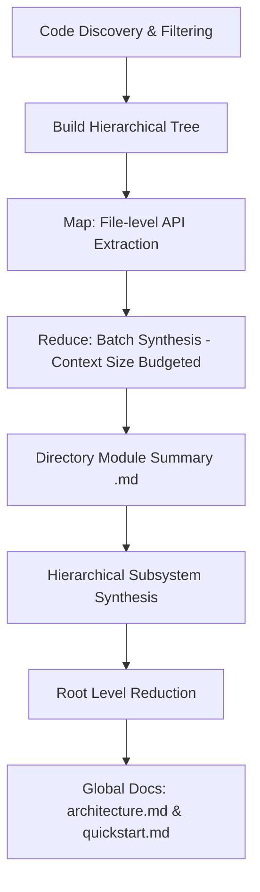

# Code-Reducer

**Code-Reducer** is a lightweight, high-performance command-line tool written in Go that automatically generates and maintains developer-friendly, comprehensive wikis for extensive repositories. 

Designed specifically for **local development and private LLMs**, Code-Reducer uses a custom **Hierarchical Map-Reduce Strategy** to analyze large codebases using small, local LLM models (e.g., 7B, 9B, or 26B parameters) via **Ollama** without exceeding context windows or degrading output quality.

---

## 🚀 Key Strengths

* **Hierarchical Map-Reduce Pipeline**: Breaks codebase synthesis into a structured Map-Reduce pipeline to document large directories recursively, staying strictly within local LLM context limits.
* **Optimized for Private & Local LLMs**: Built specifically to leverage Ollama (e.g., `ornith:9b` or `gemma4:26b`), eliminating expensive cloud API costs and keeping proprietary code local.
* **Enterprise-Grade Security Sandbox**: Features path traversal guards, atomic process locking, and TOCTOU symlink hijacking defenses for safe workspace operations.
* **Fast Incremental Updates**: Uses a filesystem SHA256 hash cache to only re-document modified files, propagating changes upward to minimize LLM calls.

---

## 🏃 Quick Start

### Prerequisites
* **Go**: Version 1.26 or higher.
* **Ollama**: Running locally with a compatible model downloaded (e.g., `ornith:9b` or `gemma4:26b`).

### 1. Build from Source (or Download Release)
*Note: Precompiled binaries are available attached to each release.*

Compile the executable binary inside the repository root:
```bash
go build -o code-reducer main.go
```

### 2. Configure the Tool
Run the interactive wizard to generate `.code-reducer.yaml`:
```bash
./code-reducer setup
```

### 3. Generate the Wiki
Initialize the documentation cache and build the initial markdown files:
```bash
./code-reducer init
```

### 4. Keep Docs Updated
Incrementally update the wiki whenever code files change:
```bash
./code-reducer update
```

---

## 🛠️ CLI Command Reference

### 1. `code-reducer setup`
Runs an interactive setup flow in the current directory to generate the `.code-reducer.yaml` configuration file. You will be prompted for:
* LLM Model ID (defaults to `ornith:9b` or reads from existing config)
* Ollama Base URL (defaults to `http://localhost:11434`)
* Ollama Context Size (defaults to `8192` or reads from existing config)
* Custom files and directories to ignore
* Documentation output folder name (defaults to `wiki`)

### 2. `code-reducer init`
Scans the repository, builds the hierarchical tree, and generates the initial set of wiki markdown pages. This command creates a metadata cache in `wiki/.metadata.json` containing the baseline metadata file summaries and sets the state commit tracker to `"local"`.
*Note: This command will fail if the project has already been initialized.*

### 3. `code-reducer update`
Detects files modified, added, or deleted since the last documentation run and performs an incremental documentation refresh:
* Computes SHA256 hashes of modified files and compares them with the `.metadata.json` cache to extract new technical facts only for files that actually changed.
* Rebuilds only the directory-level module summaries (`wiki/modules/<module>.md`) that correspond to changed files.
* Skips LLM calls for unchanged directories by reusing the cached summaries in `wiki/.metadata.json`.
* Automatically syncs the global `architecture.md` and `quickstart.md` files if necessary.
*Note: This command requires the project to have been initialized first.*

---

## ⚙️ Configuration (`.code-reducer.yaml`)

Code-Reducer stores configuration parameters in a `.code-reducer.yaml` file in the root of the repository.

### Example Configuration:
```yaml
# The model ID loaded into your local Ollama instance
model_id: "ornith:9b"

# URL of the local or remote Ollama server
ollama_base_url: "http://localhost:11434"

# Custom context window size
ollama_num_ctx: 10000

# Directory paths, files, or glob patterns to ignore during scanning
ignore:
  - ".gitignore"
  - "README.md"
  - ".code-reducer.yaml"
  - ".code-reducer.lock"
  - "code-reducer"

# Target directory to write generated markdown documentation
docs_dir: "wiki"

# Optional: Customize the LLM extraction pipeline steps
# If omitted, defaults to 4 steps: API_SIGNATURES, BUSINESS_LOGIC, STATE_AND_CONCURRENCY, ERRORS_AND_SIDE_EFFECTS
extraction_steps:
  - name: "SECURITY_AUDIT"
    prompt: "Task: Audit the file for security vulnerabilities.\nOutput: List any potential security risks."
```

### Precedence Order
Code-Reducer implements a four-tier configuration resolution chain (defined in `internal/config/resolve.go`):

```
[1. CLI Overrides] ──► [2. Environment Variables] ──► [3. YAML Config File] ──► [4. System Defaults]
```

1. **CLI Flags**: Command-line arguments like `--model-id` and `--num-ctx` take absolute priority.
2. **Environment Variables**: Overrides config file values:
   * `CODE_REDUCER_MODEL_ID` overrides `model_id`
   * `OLLAMA_BASE_URL` overrides `ollama_base_url`
   * `OLLAMA_NUM_CTX` overrides `ollama_num_ctx`
3. **YAML File (`.code-reducer.yaml`)**: Read from the repository root.
4. **Defaults**: Hardcoded fallbacks if no other configuration exists:
   * Model ID: `ornith:9b`
   * Ollama URL: `http://localhost:11434`
   * Context Size: `8192`

---

## 🏗️ Architecture & Technical Deep Dive

This section details the internal mechanics of Code-Reducer for developers wishing to contribute to the codebase or understand its design constraints.

### 1. Hierarchical Map-Reduce Engine



#### Tree Structure Construction
Code-Reducer groups scanned files into a logical directory hierarchy using a node prefix tree (`DirNode` containing children, files, and path values).

#### State Tracking & Change Propagation (`RunUpdate`)
In `update` mode, the engine dynamically determines which directory nodes are "affected" to avoid full-repository rebuilds. A directory is marked "affected" if:
* A file in its immediate files list has changed (detected via hash comparison).
* Its corresponding wiki module summary is missing from `wiki/modules/`.
* Its cached entry is missing from `.metadata.json` (as part of `MetadataCache.Modules`).
* **Propagation**: If a child directory is affected, the status propagates recursively upwards to the parent directory. This triggers a bottom-up rebuild of parent and root summaries.

#### The Map Phase (File Fact Extraction & Overlapping Chunking)
For every code file in an affected directory, the engine calculates the `SHA256` of its contents:
* **Cache Hit**: Reuses the stored facts string from the cache.
* **Cache Miss**: Analyzes the file using a **Configurable Multi-Prompt Extraction Pipeline**. To handle files that exceed the context window, the engine applies an **Overlapping Chunking Strategy**:
  * Large files are split into overlapping fragments (chunks) calculated dynamically based on `c.NumCtx` (typically allocating 75% of context for code and reserving a ~800 character overlap margin to prevent context blindness at chunk boundaries).
  * The Map phase loops through each extraction step. For each step, it executes isolated inference on every chunk of the file, injecting rich contextual metadata (like file name, chunk index, and module path) directly into the prompt to guide the LLM.

  By default, it runs 4 steps optimized for smaller ~10B LLMs:
  1. **API_SIGNATURES**: Extracts public signatures and structural contracts.
  2. **BUSINESS_LOGIC**: Infers algorithmic intent and domain rules.
  3. **STATE_AND_CONCURRENCY**: Identifies mutable state, threading models, and sync primitives.
  4. **ERRORS_AND_SIDE_EFFECTS**: Maps I/O boundaries, network calls, and error-handling philosophies.
  
  These steps can be completely overridden, removed, or expanded in your `.code-reducer.yaml` via the `extraction_steps` array.

#### The Reduce Phase (Hierarchical Consolidation)
To prevent massive files and folders from blowing out Ollama's context window, Code-Reducer applies a recursive bottom-up consolidation strategy grouped in dynamically sized batches (capped at `c.NumCtx * 3` characters):
* **File-Level Reduce**: If a single file was split into multiple chunks during the Map phase, their extracted facts are recursively deduplicated and consolidated into a unified "Developer Briefing" for the file using a specialized `reduceFileFacts` pipeline.
* **Directory-Level Reduce**: File briefings and child directory summaries are grouped into batches.
  * If a directory's components fit into a single batch, they are joined and sent to the LLM with the `module_synthesis` prompt to yield a unified directory summary.
  * If they exceed the limit, they are split into sub-batches, reduced independently to intermediate summaries, and recursively merged until a single module summary is achieved.
* Directory summaries are written to `wiki/modules/<path_with_underscores>.md` (root directory resolves to `wiki/modules/root.md`).

#### Global Synthesis Phase
After reducing the root directory (`.`), the final summary is sent to the LLM to generate two global files:
1. **System Blueprint**: `wiki/architecture.md` (High-level architecture, module boundaries, external integrations).
2. **Developer Quickstart**: `wiki/quickstart.md` (Onboarding guide, configuration guidelines).
3. **AI Agent Guidelines**: Writes guidelines to `AGENTS.md` (or appends to it) to help other incoming agentic developers find and utilize the generated documentation.

---

### 2. Security & Concurrency Sandbox

The codebase enforces security when accessing local system paths and handling file writing operations.

#### Path Traversal Guard (`SafeResolve`)
Every filesystem operation targeting repository resources passes through `security.SafeResolve`.
1. **Directory Traversal Detection**: It computes the absolute path of the repository root, joins it with the input path, cleans it (using `filepath.Clean`), and obtains the relative path.
2. **Sanity Check**: If the relative path starts with `..` or there is an error in resolving, it immediately returns a path traversal error, preventing any access to files outside the repository.

#### Atomic Process Locking (`security.AcquireLock`)
To serialize execution across multiple terminal windows or background jobs, the command engine invokes `security.AcquireLock` before starting the process:
1. **Atomic Lock Creation**: Opens `.code-reducer.lock` using the `os.O_WRONLY|os.O_CREATE|os.O_EXCL` flags. This guarantees that file creation is atomic at the OS level; if the lockfile already exists, the execution fails fast, preventing concurrent runs.
2. **PID Recording**: Writes the current Process ID (PID) to the lockfile.
3. **Git Isolation**: The runner automatically checks if `.code-reducer.lock` is ignored. If not, it safely appends it to the project's `.gitignore` file.

#### TOCTOU Symlink Hijacking & Safe File I/O
1. **Safe Reading (`ReadFileSafely`)**: When reading files, the engine performs `os.Lstat` on the path to verify it is not a symbolic link. It then opens the file descriptor, calls `f.Stat()`, and compares it with the `Lstat` results via `os.SameFile()`. If the inodes do not match, a TOCTOU symlink replacement race is detected and the read operation is aborted.
2. **Atomic Writing (`WriteFileSafely` & `SaveConfig`)**: To prevent data corruption, all file writes are performed atomically. The engine creates a temporary file in the target directory (`os.CreateTemp`), writes the contents, calls `Sync()` to flush to disk, closes the descriptor, sets the permissions, and atomically replaces the target file via `os.Rename`.

---

### 3. File Discovery, Binary, and Ignore Filters

Repository scanning is executed using `filepath.WalkDir` coupled with multiple layers of evaluation:
1. **Pruning Subtrees**: Directories that are dot-prefixed (such as `.git` or `.venv`), end in `.egg-info`, or match any ignore rules (from `.gitignore` or configuration) are skipped entirely using `filepath.SkipDir` during traversal, saving CPU cycles.
2. **Ignore Matching Rules**: Ignores loaded from the project's `.gitignore` and specified in the YAML configuration are merged and compiled using a dedicated Gitignore library (`go-gitignore`), ensuring 100% compliance with standard Git semantic rules (like negations and deep globs).
3. **Binary Classification (Null-Byte Scanner & Fast-Path)**: 
   * **Filter Flow**: Files not matching the text extension allowlist (such as unknown suffixes) are checked via binary signature fallback.
   * **Text Fast-Path**: Common source code extensions (like `.go`, `.js`, `.py`, `.md`) are instantly classified as text, entirely bypassing I/O bottlenecks.
   * **Fallback Null-Byte Scan**: Unlabelled files are caught by checking the first `1024` bytes for a null byte (`0x00`). If a null byte is found, the file is classified as a binary and skipped.

---

### 4. Git CLI and Hash-Based Incremental Rebuilds

Instead of relying on external Git diff parsing during runtime, Code-Reducer implements a robust Git verification step combined with a filesystem hash-based comparison engine:
* **`RunGit` Wrapper**: Executes `git` commands with the `--no-pager` option. It isolates `stdout` and `stderr` into separate streams, ensuring that Git warnings don't corrupt the actual command output used by the application.
* **Platform-Independent Change Detection**: The update engine discovers candidate source files on the filesystem, computes their `SHA256` hash, and compares them directly to the hashes persisted in the `.metadata.json` cache file.
* **State Classification**: 
  * **Added**: File is present in the workspace but missing from the cache.
  * **Modified**: File is present in both, but its current SHA256 does not match the cached hash.
  * **Deleted**: File exists in the cache but is missing from the workspace. Deleted files are automatically pruned from the cache.
* **Caching & Metadata Cache (`.metadata.json`)**: The metadata cache maps file paths to their `SHA256` and generated list of facts, alongside a map of directory modules. During updates, the engine matches active files against the cache and garbage-collects cache entries for deleted files.

---

### 5. LLM Client Contract & Transports

* **HTTP Request Timeout**: Configured to `10 minutes` to handle complex summarizations.
* **Ollama API Schema**: Communicates with the `/api/chat` POST endpoint.
* **Fail-Fast Client**: The LLM client is strictly fail-fast and does not perform retry attempts or exponential backoffs when calling the Ollama service. Any failure immediately returns an error.

---

## 📊 VRAM Resource Usage

Designed to run efficiently on local workstation GPUs, Code-Reducer maintains a low resource footprint. When generating its own wiki documentation under Ollama using the `ornith:9b` model with a `15K` (15,000) token context window, the dedicated VRAM usage stays at approximately **6.5 GB (6,476 MB)**. This makes it highly suitable for mainstream consumer-grade graphics cards (8GB or 12GB VRAM).

Below is a hardware performance snapshot captured during the documentation synthesis execution:


---

## 📂 Example Output

### CLI Execution Log

Here is an example of a successful Map-Reduce pipeline execution (`code-reducer init`):

```bash
$ code-reducer init
Starting Map-Reduce pipeline: init
Step 1: Code Discovery & Building Tree...
Step 2: Hierarchical Tree-Merging (Map-Reduce)...
➜ Extracting file (Step 1/4 - API_SIGNATURES): cmd/init.go
➜ Extracting file (Step 2/4 - BUSINESS_LOGIC): cmd/init.go
➜ Extracting file (Step 3/4 - STATE_AND_CONCURRENCY): cmd/init.go
➜ Extracting file (Step 4/4 - ERRORS_AND_SIDE_EFFECTS): cmd/init.go
➜ Extracting file (Step 1/4 - API_SIGNATURES): cmd/root.go
...
➜ Synthesizing directory: cmd (4 total components)
➜ LLM Synthesizing chunk for cmd (4 items)
...
➜ Extracting file (Step 1/4 - API_SIGNATURES): internal/config/env.go
...
➜ Synthesizing directory: internal/config (1 total components)
➜ LLM Synthesizing chunk for internal/config (1 items)
...
➜ Synthesizing directory: . (4 total components)
➜ LLM Synthesizing chunk for . (4 items)
Step 3: Global Architecture Synthesis...
Step 4: Generating Quickstart...
Step 5: Updating AGENTS.md...
Pipeline completed successfully!
```

### Generated Documentation

You can inspect the actual documentation generated by Code-Reducer for this repository in the local [wiki/](file:///home/arrase/Develop/code-reducer/wiki) directory:

* **System Blueprint**: [wiki/architecture.md](file:///home/arrase/Develop/code-reducer/wiki/architecture.md) – A high-level architectural overview of the system, module relations, and boundaries.
* **Developer Quickstart**: [wiki/quickstart.md](file:///home/arrase/Develop/code-reducer/wiki/quickstart.md) – A quick onboarding guide with patterns, configuration rules, and setup steps.
* **Module Documentation**: Detailed technical specifications located in the [wiki/modules/](file:///home/arrase/Develop/code-reducer/wiki/modules) subdirectory:
  * [cmd.md](file:///home/arrase/Develop/code-reducer/wiki/modules/cmd.md) – CLI commands (`root`, `setup`, `init`, `update`).
  * [internal.md](file:///home/arrase/Develop/code-reducer/wiki/modules/internal.md) – Synthesis of core application library packages.
  * [internal_config.md](file:///home/arrase/Develop/code-reducer/wiki/modules/internal_config.md) – Configuration engine and environment management details.
  * [internal_engine.md](file:///home/arrase/Develop/code-reducer/wiki/modules/internal_engine.md) – Core Map-Reduce execution pipeline and LLM client logic.
  * [internal_security.md](file:///home/arrase/Develop/code-reducer/wiki/modules/internal_security.md) – Path traversal checks and flock-based concurrency controls.
  * [internal_tools.md](file:///home/arrase/Develop/code-reducer/wiki/modules/internal_tools.md) – Helper utilities for Git integration and directory/binary discovery.

---

## 📄 License

This project is licensed under the MIT License. See [LICENSE](LICENSE) for details.
