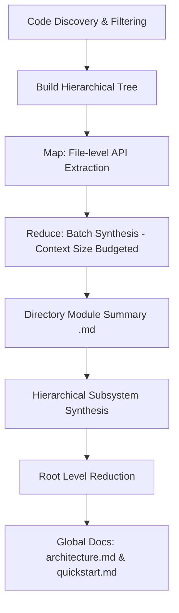
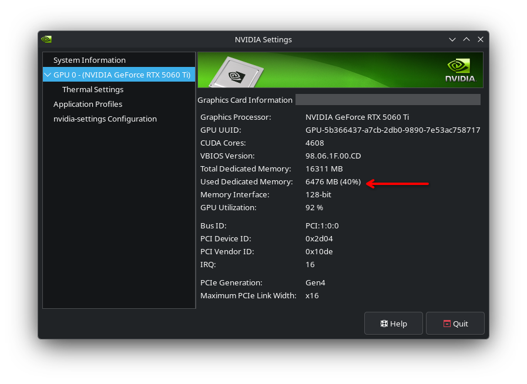

# Code-Reducer

**Code-Reducer** is a lightweight, high-performance command-line tool written in Go that automatically generates and maintains developer-friendly, comprehensive wikis for extensive repositories. 

Designed specifically for **local development and private LLMs**, Code-Reducer uses a custom **Hierarchical Map-Reduce Strategy** to analyze large codebases using small, local LLM models (e.g., 7B, 9B, or 26B parameters) via **Ollama** without exceeding context windows or degrading output quality.

---

## 🚀 Key Strengths

* **Hierarchical Map-Reduce Pipeline**: Breaks codebase synthesis into a structured Map-Reduce pipeline to document large directories recursively, staying strictly within local LLM context limits.
* **Optimized for Private & Local LLMs**: Built specifically to leverage Ollama (e.g., `ornith:9b` or `gemma4:26b`), eliminating expensive cloud API costs and keeping proprietary code local.
* **Fully Customizable Prompting System**: Allows overriding default system prompts, synthesis rules, architecture blueprints, and file fact consolidation directly from YAML configuration.
* **Enterprise-Grade Security Sandbox**: Features path traversal guards, atomic process locking, and TOCTOU symlink hijacking defenses for safe workspace operations.
* **Fast Incremental Updates**: Uses a filesystem SHA256 hash cache to only re-document modified files, propagating changes upward to minimize LLM calls.
* **Extraction Steps Cache Invalidation**: Automatically detects changes in your extraction steps pipeline and invalidates the cache to ensure documentation accuracy.

---

## 🏃 Quick Start

### Prerequisites
* **Go**: Version 1.26 or higher.
* **Ollama**: Running locally with a compatible model downloaded (e.g., `ornith:9b` or `gemma4:26b`).

### 1. Build from Source (or Download Release)
*Note: Precompiled binaries are available attached to each release.*

Compile the executable binary inside the repository root:
```bash
go build -o code-reducer main.go
```

### 2. Run the Tool (Implicit Setup)
If you run `code-reducer init` or `code-reducer update` in a terminal (TTY) and the `.code-reducer.yaml` configuration file does not exist, the interactive configuration wizard will launch automatically.

Alternatively, you can manually run the setup wizard first:
```bash
./code-reducer setup
```

### 3. Generate the Wiki
Initialize the documentation cache and build the initial markdown files:
```bash
./code-reducer init
```

### 4. Keep Docs Updated
Incrementally update the wiki whenever code files change:
```bash
./code-reducer update
```

---

## 🛠️ CLI Command Reference

### 1. `code-reducer setup`
Runs an interactive setup flow in the current directory to generate the `.code-reducer.yaml` configuration file. You will be prompted for:
* LLM Model ID (defaults to `ornith:9b` or reads from existing config)
* Ollama Base URL (defaults to `http://localhost:11434`)
* Ollama Context Size (defaults to `8192` or reads from existing config)
* Custom files and directories to ignore (comma-separated)
* Documentation output folder name (defaults to `wiki`)

### 2. `code-reducer init`
Scans the repository, builds the hierarchical tree, and generates the initial set of wiki markdown pages:
* Generates a metadata cache in `<docs_dir>/.metadata.json` containing the baseline metadata file summaries.
* Automatically generates (or appends to) an `AGENTS.md` file in the repository root to guide other AI development agents on how to find and use the generated wiki documentation.
* *Note: This command will fail if the project has already been initialized.*

### 3. `code-reducer update`
Detects files modified, added, or deleted since the last documentation run and performs an incremental documentation refresh:
* Computes SHA256 hashes of modified files and compares them with the `.metadata.json` cache to extract new technical facts only for files that actually changed.
* Rebuilds only the directory-level module summaries (`wiki/modules/<module>.md`) that correspond to changed files.
* Skips LLM calls for unchanged directories by reusing the cached summaries in `wiki/.metadata.json`.
* Bottom-up propagation: If a file inside a subdirectory changes, the subdirectory is marked "affected" and this state propagates up to the parent directory, rebuilding parents and the root summaries.
* Automatically syncs global files (`architecture.md` and `quickstart.md`) only if the root directory `.` is affected (i.e. top-level structural changes occurred) or if the files are physically missing.

---

## ⚙️ Configuration (`.code-reducer.yaml`)

Code-Reducer stores configuration parameters in a `.code-reducer.yaml` file in the root of the repository.

### Example Configuration:
```yaml
# The model ID loaded into your local Ollama instance
model_id: "ornith:9b"

# URL of the local or remote Ollama server
ollama_base_url: "http://localhost:11434"

# Custom context window size
ollama_num_ctx: 20000

# Directory paths, files, or glob patterns to ignore during scanning
ignore:
  - "README.md"
  - ".code-reducer.yaml"
  - "go.sum"
  - "go.mod"
  - "screenshots"
  - "examples"

# Target directory to write generated markdown documentation
docs_dir: "wiki"

# System instructions injected to every LLM request
system_prompt: |
  You are Code-Reducer, an expert technical writer and code analyzer. Your job is to strictly follow instructions. You do not yap, you do not write filler.
  DEFENSIVE RULES: 1. Do NOT use absolute terms ('always', 'never', 'zero') unless explicitly proven. 2. Do NOT guess downstream consequences or invent unhandled paths. If an error is swallowed, just say it is swallowed. 3. Do NOT name standard library packages unless explicitly stated in the source text. 4. Only report facts you are 100% sure about.

# Synthesis prompt for directory modules
module_synthesis_prompt: |-
  Task: Write a technical documentation page for a code module based on the provided list of its internal components.
  Rule 1: Group related functions and classes under appropriate Markdown headings.
  Rule 2: Explain the responsibility of the module and the data flow.
  Rule 3: Keep it highly technical and dense.

# Synthesis prompt for the global architecture overview
architecture_prompt: |-
  Task: Write a global architecture or quickstart document based on the module summaries.
  Rule 1: Explain the system boundaries and how the modules interact.
  Rule 2: Provide a dense, developer-friendly overview.

# Prompt used to consolidate chunks of the same file
file_fact_consolidation_prompt: |-
  You are a specialized code documentation assistant.
  Consolidate, deduplicate and merge the following facts extracted from different chunks of the same file into a single, cohesive summary.

# Customize the LLM extraction pipeline steps
extraction_steps:
  - name: "API_SIGNATURES"
    prompt: "Task: Extract the public API surface.\nOutput: A strict Markdown list of all exported or public elements (classes, functions, methods, types). Include parameters and return types. Do not explain internal execution logic."
  - name: "BUSINESS_LOGIC"
    prompt: "Task: Extract the core purpose and domain rules.\nOutput: Explain the primary domain problem this code solves. List the high-level algorithm steps. Ignore syntax, standard library usage, and basic implementation details."
  - name: "STATE_AND_CONCURRENCY"
    prompt: "Task: Identify mutable state and thread safety.\nOutput: List global variables, shared states, or class-level properties that are modified. Identify synchronization mechanisms (locks, mutexes, async/await, atomic types). If entirely stateless, output exactly: 'No mutable state'."
  - name: "ERRORS_AND_SIDE_EFFECTS"
    prompt: "Task: Analyze external I/O and error propagation.\nOutput: Detail interactions with external systems (network, disk, databases, APIs). Explain how errors are propagated (exceptions, error return codes, crash/panic). If no I/O exists, state 'No external side effects'."
```

### Precedence Order
Code-Reducer implements a four-tier configuration resolution chain:

```
[1. CLI Overrides] ──► [2. Environment Variables] ──► [3. YAML Config File] ──► [4. System Defaults]
```

1. **CLI Flags**: Command-line arguments like `--model-id` and `--num-ctx` take absolute priority.
2. **Environment Variables**: Overrides config file values:
   * `CODE_REDUCER_MODEL_ID` overrides `model_id`
   * `OLLAMA_BASE_URL` overrides `ollama_base_url`
   * `OLLAMA_NUM_CTX` overrides `ollama_num_ctx`
3. **YAML File (`.code-reducer.yaml`)**: Read from the repository root.
4. **Defaults**: Hardcoded fallbacks if no other configuration exists.

### Multi-language & Infrastructure Support
Code-Reducer can be configured to document not only software codebases but also Infrastructure-as-Code (IaC) or cloud topology. You can inspect an example config tailored for Terraform project analysis in [examples/terraform/.code-reducer.yaml](examples/terraform/.code-reducer.yaml).

---

## 🏗️ Architecture & Technical Deep Dive

### 1. Hierarchical Map-Reduce Engine



#### Tree Structure Construction
Code-Reducer groups scanned files into a logical directory hierarchy using a node prefix tree (`DirNode` containing children, files, and path values).

#### State Tracking & Change Propagation (`RunUpdate`)
In `update` mode, the engine dynamically determines which directory nodes are "affected" to avoid full-repository rebuilds. A directory is marked "affected" if:
* A file in its immediate files list has changed (detected via hash comparison).
* Its corresponding wiki module summary is missing from `wiki/modules/`.
* Its cached entry is missing from `.metadata.json` (as part of `MetadataCache.Modules`).
* **Propagation**: If a child directory is affected, the status propagates recursively upwards to the parent directory. This triggers a bottom-up rebuild of parent and root summaries.

#### Cache Invalidation on Extraction Steps Change
The metadata cache contains a `steps_hash` field representing the SHA256 of the configuration's `extraction_steps` array. During the `update` pipeline, the engine calculates the hash of the current extraction steps. If it differs from `cache.StepsHash`, it clears file facts and module caches, forcing a full regeneration. This ensures that when extraction requirements change, the entire documentation is safely updated.

#### The Map Phase (Dynamic Chunking with Overlap)
For every code file in an affected directory, the engine calculates the `SHA256` of its contents:
* **Cache Hit**: Reuses the stored facts string from the cache.
* **Cache Miss**: Analyzes the file using the configurable `extraction_steps` pipeline.
* **Llm Context-Based File Limits**: Large files are split into overlapping fragments. The engine calculates a dynamic truncation limit: it allocates 75% of `NumCtx` (typically assuming ~4 characters per token) to the file content, reserving the remaining 25% for prompts and output context. An overlap margin (defaults to 800 characters) is used to prevent context blindness at boundaries.
* Isolated inference is run on each chunk for each extraction step.

#### The Reduce Phase (Hierarchical Consolidation & Truncation Safety)
To prevent massive folders from blowing out Ollama's context window, Code-Reducer applies a recursive bottom-up consolidation strategy grouped in dynamically sized batches (capped at `NumCtx * 3` characters):
* **File-Level Reduce**: If a single file was split into multiple chunks during the Map phase, their extracted facts are consolidated into a unified briefing via `reduceFileFacts`.
* **Directory-Level Reduce**: File briefings and child directory summaries are grouped into batches.
  * If a directory's components fit into a single batch, they are joined and sent to the LLM with the `module_synthesis_prompt` to yield a unified directory summary.
  * If they exceed the limit, they are split into sub-batches, reduced independently, and recursively merged.
  * **Truncation Safeguard**: In `reduceItems`, if a single item exceeds the character limit, it is automatically truncated (appending `...[truncated]`) to avoid infinite loops and context buffer overflows.

#### Global Synthesis Phase
After reducing the root directory (`.`), the final summary is sent to the LLM to generate:
1. **System Blueprint**: `wiki/architecture.md` (High-level architecture, module boundaries, external integrations).
2. **Developer Quickstart**: `wiki/quickstart.md` (Onboarding guide, configuration guidelines).
3. **AI Agent Guidelines**: Writes guidelines to `AGENTS.md` (or appends to it) to help other incoming agentic developers find and utilize the generated documentation.

---

### 2. Security & Concurrency Sandbox

The codebase enforces security when accessing local system paths and handling file writing operations.

#### Path Traversal Guard (`SafeResolve`)
Every filesystem operation targeting repository resources passes through `security.SafeResolve`.
1. **Directory Traversal Detection**: It computes the absolute path of the repository root, joins it with the input path, cleans it, and obtains the relative path.
2. **Sanity Check**: If the relative path starts with `..` or there is an error in resolving, it immediately returns a path traversal error, preventing any access to files outside the repository.

#### Atomic Process Locking (`security.AcquireLock`)
To serialize execution across multiple terminal windows or background jobs, the command engine invokes `security.AcquireLock` before starting the process:
1. **Atomic Lock Creation**: Opens `.code-reducer.lock` using the `os.O_WRONLY|os.O_CREATE|os.O_EXCL` flags. This guarantees that file creation is atomic at the OS level; if the lockfile already exists, the execution fails fast, preventing concurrent runs.
2. **PID Recording**: Writes the current Process ID (PID) to the lockfile.
3. **Git Isolation**: The runner automatically checks if `.code-reducer.lock` is ignored. If not, it safely appends it to the project's `.gitignore` file.

#### TOCTOU Symlink Hijacking & Safe File I/O
1. **Safe Reading (`ReadFileSafely`)**: When reading files, the engine performs `os.Lstat` on the path to verify it is not a symbolic link. It then opens the file descriptor, calls `f.Stat()`, and compares it with the `Lstat` results via `os.SameFile()`. If the inodes do not match, a TOCTOU symlink replacement race is detected and the read operation is aborted.
2. **Atomic Writing (`WriteFileSafely` & `SaveConfig`)**: To prevent data corruption, all file writes are performed atomically. The engine creates a temporary file in the target directory (`os.CreateTemp`), writes the contents, calls `Sync()` to flush to disk, closes the descriptor, sets the permissions, and atomically replaces the target file via `os.Rename`.

---

### 3. File Discovery, Binary, and Ignore Filters

Repository scanning is executed using `filepath.WalkDir` coupled with multiple layers of evaluation:
1. **Pruning Subtrees**: Directories that are dot-prefixed (such as `.git` or `.venv`), end in `.egg-info`, or match any ignore rules (from `.gitignore` or configuration) are skipped entirely using `filepath.SkipDir` during traversal, saving CPU cycles.
2. **Ignore Matching Rules**: Ignores loaded from the project's `.gitignore` and specified in the YAML configuration are merged and compiled using a dedicated Gitignore library (`go-gitignore`), ensuring 100% compliance with standard Git semantic rules.
3. **Binary Classification (Null-Byte Scanner & Fast-Path)**: 
   * **Text Fast-Path**: Common source code extensions (like `.go`, `.js`, `.py`, `.md`) are instantly classified as text, entirely bypassing I/O bottlenecks.
   * **Fallback Null-Byte Scan**: Unlabelled files are caught by checking the first `1024` bytes for a null byte (`0x00`). If a null byte is found, the file is classified as a binary and skipped.

---

### 4. Git CLI and Hash-Based Incremental Rebuilds

Instead of relying on external Git diff parsing during runtime, Code-Reducer implements a robust Git verification step combined with a filesystem hash-based comparison engine:
* **`RunGit` Wrapper**: Executes `git` commands with the `--no-pager` option. It isolates `stdout` and `stderr` into separate streams, ensuring that Git warnings don't corrupt the actual command output used by the application.
* **Platform-Independent Change Detection**: The update engine discovers candidate source files on the filesystem, computes their `SHA256` hash, and compares them directly to the hashes persisted in the `.metadata.json` cache file.
* **State Classification**: 
  * **Added**: File is present in the workspace but missing from the cache.
  * **Modified**: File is present in both, but its current SHA256 does not match the cached hash.
  * **Deleted**: File exists in the cache but is missing from the workspace. Deleted files are automatically pruned from the cache.
* **Caching & Metadata Cache (`.metadata.json`)**: The metadata cache maps file paths to their `SHA256` and generated list of facts, alongside a map of directory modules. During updates, the engine matches active files against the cache and garbage-collects cache entries for deleted files.

---

### 5. LLM Client Contract & Transports

* **HTTP Request Timeout**: Configured to `10 minutes` to handle complex summarizations.
* **Ollama API Schema**: Communicates with the `/api/chat` POST endpoint.
* **Fail-Fast Client**: The LLM client is strictly fail-fast and does not perform retry attempts or exponential backoffs when calling the Ollama service. Any failure immediately returns an error.

---

## 📊 VRAM Resource Usage

Designed to run efficiently on local workstation GPUs, Code-Reducer maintains a low resource footprint. When generating its own wiki documentation under Ollama using the `ornith:9b` model with a `15K` (15,000) token context window, the dedicated VRAM usage stays at approximately **6.5 GB (6,476 MB)**. This makes it highly suitable for mainstream consumer-grade graphics cards (8GB or 12GB VRAM).

Below is a hardware performance snapshot captured during the documentation synthesis execution:



---

## 📂 Example Output

### CLI Execution Log

Here is an example of a successful Map-Reduce pipeline execution (`code-reducer init`):

```bash
$ code-reducer init
Starting Map-Reduce pipeline: init
Step 1: Code Discovery & Building Tree...
Step 2: Hierarchical Tree-Merging (Map-Reduce)...
➜ Extracting file (Step 1/4 - API_SIGNATURES): cmd/init.go
➜ Extracting file (Step 2/4 - BUSINESS_LOGIC): cmd/init.go
➜ Extracting file (Step 3/4 - STATE_AND_CONCURRENCY): cmd/init.go
➜ Extracting file (Step 4/4 - ERRORS_AND_SIDE_EFFECTS): cmd/init.go
➜ Extracting file (Step 1/4 - API_SIGNATURES): cmd/root.go
...
➜ Synthesizing directory: cmd (4 total components)
➜ LLM Synthesizing chunk for cmd (4 items)
...
➜ Extracting file (Step 1/4 - API_SIGNATURES): internal/config/resolve.go
...
➜ Synthesizing directory: internal/config (3 total components)
➜ LLM Synthesizing chunk for internal/config (3 items)
...
➜ Synthesizing directory: . (4 total components)
➜ LLM Synthesizing chunk for . (4 items)
Step 3: Global Architecture Synthesis...
Step 4: Generating Quickstart...
Step 5: Updating AGENTS.md...
Pipeline completed successfully!
```

### Generated Documentation

You can inspect the actual documentation generated by Code-Reducer for this repository in the local [wiki/](wiki/) directory:

* **System Blueprint**: [wiki/architecture.md](wiki/architecture.md) – A high-level architectural overview of the system, module relations, and boundaries.
* **Developer Quickstart**: [wiki/quickstart.md](wiki/quickstart.md) – A quick onboarding guide with patterns, configuration rules, and setup steps.
* **Module Documentation**: Detailed technical specifications located in the [wiki/modules/](wiki/modules/) subdirectory:
  * [cmd.md](wiki/modules/cmd.md) – CLI commands (`root`, `setup`, `init`, `update`).
  * [internal.md](wiki/modules/internal.md) – Synthesis of core application library packages.
  * [internal_config.md](wiki/modules/internal_config.md) – Configuration engine and environment management details.
  * [internal_engine.md](wiki/modules/internal_engine.md) – Core Map-Reduce execution pipeline and LLM client logic.
  * [internal_security.md](wiki/modules/internal_security.md) – Path traversal checks and flock-based concurrency controls.
  * [internal_tools.md](wiki/modules/internal_tools.md) – Helper utilities for Git integration and directory/binary discovery.

---

## 📄 License

This project is licensed under the MIT License. See [LICENSE](LICENSE) for details.
