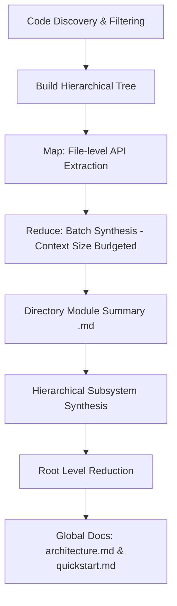

# Code-Reducer

**Code-Reducer** is a lightweight, high-performance command-line tool written in Go that automatically generates and maintains developer-friendly, comprehensive wikis for extensive repositories. 

Designed specifically for **local development and private LLMs**, Code-Reducer uses a custom **Hierarchical Map-Reduce Strategy** to analyze large codebases using small, local LLM models (e.g., 7B, 9B, or 26B parameters) via **Ollama** without exceeding context windows or degrading output quality.

---

## 🚀 Key Strengths

### 1. Hierarchical Map-Reduce Strategy
Standard LLMs fail when fed massive codebases due to context window limits, prompt dilution, and high token costs. Code-Reducer solves this by breaking codebase synthesis into a structured Map-Reduce pipeline:
- **Map Phase**: Extracts precise API signatures (exported functions, classes, interfaces, structures) and a one-sentence technical description for each source file.
- **Reduce Phase**: Recursively merges and synthesizes these summaries bottom-up through the folder structure, using dynamic size-based chunking (by default, batches are budgeted based on the context size limit, up to `3 * NumCtx` characters) to prevent context window overflow.
- **Global Synthesis**: Synthesizes the root directory summary into `architecture.md` (overall system boundaries) and `quickstart.md` (developer-facing onboarding).

### 2. Tailored for Small, Local LLMs (Ollama)
Code-Reducer is optimized for local execution using Ollama:
- Generates high-quality documentation using small models (such as `ornith:9b` or `gemma4:26b-a4b-it-qat`).
- Avoids the need for expensive API subscriptions or sending proprietary code to third-party cloud LLM providers.

### 3. Enterprise-Grade Security & Concurrency Controls
- **Path Traversal Prevention**: Resolves paths using a safe sanitizer (`SafeResolve`) that validates relative path clean checks, ensuring operations never escape repository boundaries.
- **Atomic Process Locks**: Employs an exclusive file locking mechanism (`.code-reducer.lock` using atomic `os.O_EXCL|os.O_CREATE` file creation flags) to serialize execution and prevent concurrent runs.
- **TOCTOU Symlink Hijacking Defense**: Ensures safe file writing (`WriteFileSafely`) using an atomic opening pattern, `os.Lstat` symlink checks, and file descriptor validation via `os.SameFile()` to prevent race condition attacks.
- **Binary/Junk File Exclusion**: Employs null-byte file detection and extension blacklisting to prevent feeding large compiled assets, images, or compressed archives to the LLM.

---

## 🗺️ How the Map-Reduce Pipeline Works



---

## 📂 Example Output

You can inspect the actual documentation generated by Code-Reducer for this repository in the local [wiki/](file:///home/arrase/Develop/code-reducer/wiki) directory:

- **System Blueprint**: [wiki/architecture.md](file:///home/arrase/Develop/code-reducer/wiki/architecture.md) – A high-level architectural overview of the system, module relations, and boundaries.
- **Developer Quickstart**: [wiki/quickstart.md](file:///home/arrase/Develop/code-reducer/wiki/quickstart.md) – A quick onboarding guide with patterns, configuration rules, and setup steps.
- **Module Documentation**: Detailed technical specifications located in the [wiki/modules/](file:///home/arrase/Develop/code-reducer/wiki/modules) subdirectory:
  - [cmd.md](file:///home/arrase/Develop/code-reducer/wiki/modules/cmd.md) – CLI commands (`root`, `setup`, `init`, `update`).
  - [internal.md](file:///home/arrase/Develop/code-reducer/wiki/modules/internal.md) – Synthesis of core application library packages.
  - [internal_config.md](file:///home/arrase/Develop/code-reducer/wiki/modules/internal_config.md) – Configuration engine and environment management details.
  - [internal_engine.md](file:///home/arrase/Develop/code-reducer/wiki/modules/internal_engine.md) – Core Map-Reduce execution pipeline and LLM client logic.
  - [internal_security.md](file:///home/arrase/Develop/code-reducer/wiki/modules/internal_security.md) – Path traversal checks and flock-based concurrency controls.
  - [internal_tools.md](file:///home/arrase/Develop/code-reducer/wiki/modules/internal_tools.md) – Helper utilities for Git integration and directory/binary discovery.

---

## 🏗️ Technical Deep Dive

### 1. Security & Concurrency Sandbox

The codebase enforces security when accessing local system paths and handling file writing operations.

#### Path Traversal Guard (`SafeResolve`)
Every filesystem operation targeting repository resources passes through `security.SafeResolve`.
1. **Directory Traversal Detection**: It computes the absolute path of the repository root, joins it with the input path, cleans it (using `filepath.Clean`), and obtains the relative path.
2. **Sanity Check**: If the relative path starts with `..` or there is an error in resolving, it immediately returns a path traversal error, preventing any access to files outside the repository.

#### Atomic Process Locking (`security.AcquireLock`)
To serialize execution across multiple terminal windows or background jobs, the command engine invokes `security.AcquireLock` before starting the process:
1. **Atomic Lock Creation**: Opens `.code-reducer.lock` using the `os.O_WRONLY|os.O_CREATE|os.O_EXCL` flags. This guarantees that file creation is atomic at the OS level; if the lockfile already exists, the execution fails fast, preventing concurrent runs.
2. **PID Recording**: Writes the current Process ID (PID) to the lockfile.
3. **Git Isolation**: The runner automatically checks if `.code-reducer.lock` is ignored. If not, it safely appends it to the project's `.gitignore` file.

#### TOCTOU Symlink Hijacking Defense (`WriteFileSafely`)
When writing documentation files to the filesystem:
1. **Open Without Truncation**: Omit `O_TRUNC` on initial open (`os.OpenFile`) to prevent truncating a target file if the path has been replaced with a symlink.
2. **Symlink Verification**: Perform `os.Lstat` on the target path to verify that it is not a symbolic link.
3. **Descriptor Validation**: Obtain stats on the open file descriptor (`f.Stat()`) and compare it with the `Lstat` results via `os.SameFile()`. If the inodes do not match, a TOCTOU (Time-of-Check to Time-of-Use) symlink replacement race is detected and the write operation is aborted.
4. **Safe Truncation & Write**: Only after validation is complete is the file safely truncated (`f.Truncate(0)`) and written.

---

### 2. Configuration Resolution Pipeline

Code-Reducer implements a four-tier configuration resolution chain in `internal/config/env.go`:

```
[1. CLI Overrides] ──► [2. Environment Variables] ──► [3. YAML Config File] ──► [4. System Defaults]
```

#### Precedence Order:
1. **CLI Flags**: `--model-id` and `--num-ctx` take absolute priority.
2. **Environment Variables**: `CODE_REDUCER_MODEL_ID`, `OLLAMA_BASE_URL`, and `OLLAMA_NUM_CTX` override file values.
3. **YAML File (`.code-reducer.yaml`)**: Read from the repository root.
4. **Defaults**: Hardcoded fallbacks (Model ID: `gemma4:26b-a4b-it-qat`, Ollama URL: `http://localhost:11434`, Context: `8192`).

#### LangChain Tracing Setup
On configuration resolution, tracing parameters (`LANGSMITH_API_KEY`, `LANGCHAIN_PROJECT`, `LANGCHAIN_TRACING_V2`) are parsed from environment variables or the YAML configuration file directly into the internal configuration struct for integration with the execution framework.

---

### 3. File Discovery, Binary, and Ignore Filters

Repository scanning is executed using `filepath.WalkDir` coupled with multiple layers of evaluation:
1. **Pruning Subtrees**: Common dependency, cache, and build directories (`.git`, `node_modules`, `bower_components`, `dist`, `build`, `cache`, `__pycache__`, `venv`, `.venv`, and directory names ending in `.egg-info`) are skipped using `filepath.SkipDir` at the walk root, saving CPU cycles.
2. **Ignore Matching Rules**: Ignores specified in the YAML configuration are resolved with `ShouldIgnorePath`. This evaluates four matching schemes:
   - **Exact Match**: The relative cleaned path matches the ignore pattern.
   - **Prefix Match**: The path resides within a subdirectory matching the ignore pattern.
   - **Component-Level Match**: A folder name anywhere in the path matches the pattern.
   - **Glob Match**: The pattern is evaluated using glob-style matching (`filepath.Match`).
3. **Binary Classification (Null-Byte Scanner)**: Files with blacklisted extensions (e.g. `.png`, `.pdf`, `.zip`, `.exe`, `.so`) or lockfile suffixes (`*-lock.json`, `pnpm-lock.yaml`) are ignored. Unlabelled binaries are caught by checking the first `1024` bytes for a null byte (`0x00`). If a null byte is found, the file is classified as a binary and skipped.

---

### 4. Git CLI and Hash-Based Incremental Rebuilds

Instead of relying on external Git diff parsing during runtime, Code-Reducer implements a robust Git verification step combined with a filesystem hash-based comparison engine:
- **`RunGit` Wrapper**: Executes `git` commands with the `--no-pager` option and captures combined output to verify that the workspace is a valid Git repository before running.
- **Platform-Independent Change Detection**: The update engine discovers candidate source files on the filesystem, computes their `SHA256` hash, and compares them directly to the hashes persisted in the `.metadata.json` cache file.
- **State Classification**: 
  - **Added**: File is present in the workspace but missing from the cache.
  - **Modified**: File is present in both, but its current SHA256 does not match the cached hash.
  - **Deleted**: File exists in the cache but is missing from the workspace. Deleted files are automatically pruned from the cache.

---

### 5. Hierarchical Map-Reduce Engine

```
Code Files ──► [Map Phase] ──► File Facts ──► [Reduce Phase (Context-Budgeted Chunks)] ──► Directory Modules ──► [Global Synthesis] ──► wiki/
```

#### Tree Structure Construction
Code-Reducer groups scanned files into a logical directory hierarchy using a node prefix tree (`DirNode` containing children, files, and path values).

#### State Tracking & Change Propagation (`RunUpdate`)
In `update` mode, the engine dynamically determines which directory nodes are "affected" to avoid full-repository rebuilds. A directory is marked "affected" if:
- A file in its immediate files list has changed (detected via hash comparison).
- Its corresponding wiki module summary is missing from `wiki/modules/`.
- Its cached entry is missing from `.metadata.json` (as part of `MetadataCache.Modules`).
- **Propagation**: If a child directory is affected, the status propagates recursively upwards to the parent directory. This triggers a bottom-up rebuild of parent and root summaries.

#### The Map Phase (File Fact Extraction)
For every code file in an affected directory, the engine calculates the `SHA256` of its contents:
- **Cache Hit**: Reuses the stored facts string from the cache.
- **Cache Miss**: Reads up to the first `8,000` characters, wraps it in a prompt, and calls the LLM with the `extract_file` instructions. The model returns a markdown list of exported functions, classes, structs, and interfaces, with exactly a one-sentence technical explanation of their purpose. Outer markdown fences are stripped via regex.

#### The Reduce Phase (Recursive Chunk Synthesis)
To prevent massive folders from blowing out Ollama's context window, component summaries (files and child directory summaries) are merged bottom-up in batches dynamically sized by character length:
- **Length Limit**: The context budget is calculated as `c.NumCtx * 3` characters (defaulting to `24,576` characters).
- **Chunk Merging**: Components are grouped into batches that fit within this limit.
  - If a directory's components fit into a single batch, they are joined with double newlines and sent directly to the LLM with the `module_synthesis` prompt to yield a unified directory summary.
  - If they exceed the limit, they are split recursively into sub-batches, reduced independently to intermediate summaries, and then recursively merged until a single module summary is achieved.
- Directory summaries are written to `wiki/modules/<path_with_underscores>.md` (root directory resolves to `wiki/modules/root.md`).

#### Global Synthesis Phase
After reducing the root directory (`.`), the final summary is sent to the LLM to generate two global files:
1. **System Blueprint**: `wiki/architecture.md` (High-level architecture, module boundaries, external integrations).
2. **Developer Quickstart**: `wiki/quickstart.md` (Onboarding guide, configuration guidelines).
3. **AI Agent Guidelines**: Writes guidelines to `AGENTS.md` (or appends to it) to help other incoming agentic developers find and utilize the generated documentation.

#### Caching & Metadata Cache (`.metadata.json`)
The metadata cache maps file paths to their `SHA256` and generated list of facts, alongside a map of directory modules. During updates, the engine matches active files against the cache, garbage-collects cache entries for deleted files, and updates the `last_documented_commit` tracker to `"local"` upon a successful run.

---

### 6. LLM Client Contract & Transports

- **HTTP Request Timeout**: Configured to `10 minutes` to handle complex summarizations.
- **Ollama API Schema**: Communicates with the `/api/chat` POST endpoint.
- **Fail-Fast Client**: The LLM client is strictly fail-fast and does not perform retry attempts or exponential backoffs when calling the Ollama service. Any failure immediately returns an error.
- **Stream Processing**: Fully supports streaming response chunks via `StreamLLM` using line-by-line streaming from the `/api/chat` endpoint and invoking a token-callback. However, the recursive Map-Reduce pipeline invokes the synchronous `CallLLM` method for processing stability.

---

## 🛠️ CLI Command Reference

### 1. Configure the Tool
```bash
code-reducer setup
```
Runs an interactive setup flow in the current directory to generate the `.code-reducer.yaml` configuration file. You will be prompted for:
- LLM Model ID (defaults to `gemma4:26b-a4b-it-qat` or reads from existing config)
- Ollama Base URL (defaults to `http://localhost:11434`)
- Ollama Context Size (defaults to `8192` or reads from existing config)
- Custom files and directories to ignore
- Documentation output folder name (defaults to `wiki`)

### 2. Initialize Documentation
```bash
code-reducer init
```
Scans the repository, builds the hierarchical tree, and generates the initial set of wiki markdown pages. This command creates a metadata cache in `wiki/.metadata.json` containing the baseline metadata file summaries and sets the state commit tracker to `"local"`.
*Note: This command will fail if the project has already been initialized.*

### 3. Update Documentation (Incremental Rebuilds)
```bash
code-reducer update
```
Detects files modified, added, or deleted since the last documentation run. It performs an incremental documentation refresh:
- Computes SHA256 hashes of modified files and compares them with the `.metadata.json` cache to extract new technical facts only for files that actually changed.
- Rebuilds only the directory-level module summaries (`wiki/modules/<module>.md`) that correspond to changed files.
- Skips LLM calls for unchanged directories by reusing the cached summaries in `wiki/.metadata.json`.
- Automatically syncs the global `architecture.md` and `quickstart.md` files if necessary.
*Note: This command requires the project to have been initialized first.*

---

## ⚙️ Configuration (`.code-reducer.yaml`)

The tool creates a local `.code-reducer.yaml` file in the root of your project. Below is an example configuration:

```yaml
# The model ID loaded into your local Ollama instance
model_id: "ornith:9b"

# URL of the local or remote Ollama server
ollama_base_url: "http://localhost:11434"

# Custom context window size
ollama_num_ctx: 10000

# Directory paths, files, or glob patterns to ignore during scanning
ignore:
  - ".gitignore"
  - "README.md"
  - ".code-reducer.yaml"
  - ".code-reducer.lock"
  - "code-reducer"

# Target directory to write generated markdown documentation
docs_dir: "wiki"
```

### Environment Overrides
You can override configuration settings on-the-fly using the following flags or environment variables:
- Flag `--model-id` or environment variable `CODE_REDUCER_MODEL_ID`
- Flag `--num-ctx` or environment variable `OLLAMA_NUM_CTX`
- Environment variable `OLLAMA_BASE_URL`

---

## 🛠️ Building and Running Locally

To build the project locally, ensure you have Go 1.21+ installed, and run:

```bash
# Build the binary
go build -o code-reducer main.go

# Run the setup wizard
./code-reducer setup

# Generate your codebase wiki
./code-reducer init

# Refresh documentation incrementally when code changes
./code-reducer update
```

---

## 📄 License

This project is licensed under the MIT License. See [LICENSE](LICENSE) for details.
