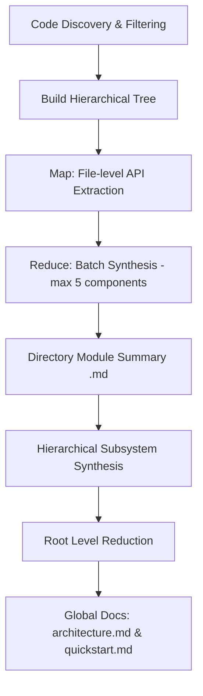

# Code-Reducer

**Code-Reducer** is a lightweight, high-performance command-line tool written in Go that automatically generates and maintains developer-friendly, comprehensive wikis for extensive repositories. 

Designed specifically for **local development and private LLMs**, Code-Reducer uses a custom **Hierarchical Map-Reduce Strategy** to analyze large codebases using small, local LLM models (e.g., 7B, 9B, or 26B parameters) via **Ollama** without exceeding context windows or degrading output quality.

---

## 🚀 Key Strengths

### 1. Hierarchical Map-Reduce Strategy
Standard LLMs fail when fed massive codebases due to context window limits, prompt dilution, and high token costs. Code-Reducer solves this by breaking codebase synthesis into a structured Map-Reduce pipeline:
- **Map Phase**: Extracts precise API signatures (exported functions, classes, interfaces, structures) and a one-sentence technical description for each source file.
- **Reduce Phase**: Recursively merges and synthesizes these summaries bottom-up through the folder structure in batches of 5 components, producing high-density directory-level module summaries.
- **Global Synthesis**: Synthesizes the root directory summary into `architecture.md` (overall system boundaries) and `quickstart.md` (developer-facing onboarding).

### 2. Tailored for Small, Local LLMs (Ollama)
Code-Reducer is optimized for local execution using Ollama:
- Generates high-quality documentation using small models (such as `ornith:9b` or `gemma4:26b-a4b-it-qat`).
- Avoids the need for expensive API subscriptions or sending proprietary code to third-party cloud LLM providers.
- **Dynamic Context Scaling**: Automatically detects the host machine's total memory (RAM) and scales the Ollama context window (`num_ctx`) dynamically between 4,096 and 32,768 tokens to maximize throughput without crashing the local server.

### 3. Enterprise-Grade Security & Robustness
- **Symlink & Path Traversal Prevention**: Resolves paths using a safe path traversal sanitizer (`SafeResolve`) that validates paths and ensures symlinks never point outside the repository boundaries (mitigating TOCTOU attacks).
- **Exclusive Process Locks**: Uses a file locking mechanism (`.code-reducer.lock` via `flock`) to serialize operations and prevent file corruption from concurrent runs.
- **Binary/Junk File Exclusion**: Employs null-byte file detection and extension blacklisting to prevent feeding large compiled assets, images, or compressed archives to the LLM.

---

## 🗺️ How the Map-Reduce Pipeline Works



---

## 📂 Example Output

You can inspect the actual documentation generated by Code-Reducer for this repository in the local [wiki/](file:///home/arrase/Develop/code-reducer/wiki) directory:

- **System Blueprint**: [wiki/architecture.md](file:///home/arrase/Develop/code-reducer/wiki/architecture.md) – A high-level architectural overview of the system, module relations, and boundaries.
- **Developer Quickstart**: [wiki/quickstart.md](file:///home/arrase/Develop/code-reducer/wiki/quickstart.md) – A quick onboarding guide with patterns, configuration rules, and setup steps.
- **Module Documentation**: Detailed technical specifications located in the [wiki/modules/](file:///home/arrase/Develop/code-reducer/wiki/modules) subdirectory:
  - [cmd.md](file:///home/arrase/Develop/code-reducer/wiki/modules/cmd.md) – CLI commands (`root`, `setup`, `init`).
  - [internal.md](file:///home/arrase/Develop/code-reducer/wiki/modules/internal.md) – Synthesis of core application library packages.
  - [internal_config.md](file:///home/arrase/Develop/code-reducer/wiki/modules/internal_config.md) – Configuration engine and environment management details.
  - [internal_engine.md](file:///home/arrase/Develop/code-reducer/wiki/modules/internal_engine.md) – Core Map-Reduce execution pipeline and LLM client logic.
  - [internal_security.md](file:///home/arrase/Develop/code-reducer/wiki/modules/internal_security.md) – Path traversal checks and flock-based concurrency controls.
  - [internal_tools.md](file:///home/arrase/Develop/code-reducer/wiki/modules/internal_tools.md) – Helper utilities for Git integration and directory/binary discovery.

---

## 🛠️ CLI Command Reference

Code-Reducer provides a streamlined, simple command-line interface:

### 1. Configure the Tool
```bash
code-reducer setup
```
Runs an interactive setup flow in the current directory to generate the `.code-reducer.yaml` configuration file. You will be prompted for:
- LLM Model ID (defaults to `gemma4:26b-a4b-it-qat` or reads from existing config)
- Ollama Base URL (defaults to `http://localhost:11434`)
- Ollama Context Size (defaults to `8192` or auto-scales based on memory)
- Custom files and directories to ignore
- Documentation output folder name (defaults to `wiki`)

### 2. Initialize Documentation
```bash
code-reducer init [message]
```
Scans the repository, builds the hierarchical tree, and generates the initial set of wiki markdown pages. If no `.code-reducer.yaml` is found, the interactive setup flow is triggered automatically.

---

## ⚙️ Configuration (`.code-reducer.yaml`)

The tool creates a local `.code-reducer.yaml` file in the root of your project. Below is an example configuration:

```yaml
# The model ID loaded into your local Ollama instance
model_id: "ornith:9b"

# URL of the local or remote Ollama server
ollama_base_url: "http://localhost:11434"

# Custom context window size (defaults to memory-based scaling if left empty)
ollama_num_ctx: 10000

# Directory paths, files, or glob patterns to ignore during scanning
ignore:
  - ".gitignore"
  - "README.md"
  - ".code-reducer.yaml"
  - ".code-reducer.lock"
  - "code-reducer"

# Target directory to write generated markdown documentation
docs_dir: "wiki"
```

### Environment Overrides
You can override configuration settings on-the-fly using the following flags or environment variables:
- Flag `--model-id` or environment variable `CODE_REDUCER_MODEL_ID`
- Flag `--num-ctx` or environment variable `OLLAMA_NUM_CTX`
- Environment variable `OLLAMA_BASE_URL`

---

## 🏗️ Architecture Under the Hood

The codebase is organized cleanly to separate concerns:
- **`cmd/`**: Standard Cobra CLI commands (`root`, `setup`, `init`). Coordinates configuration loading, process locks, and triggers the documentation engine.
- **`internal/config/`**: Parses `.code-reducer.yaml`, resolves host RAM memory via `/proc/meminfo`, and sets up environment overrides.
- **`internal/engine/`**: Coordinates the Map-Reduce pipeline.
  - `engine.go`: Handles LLM requests, response parsing, and hierarchical folder traversals.
  - `context.go`: Implements basic token estimation, prompt wrapping, and a BM25 relevance filter for target search/ranking.
  - `json_parser.go`: Sanitizes and extracts valid JSON payloads from raw LLM markdown responses.
- **`internal/security/`**: Secures execution. Contains file locking controls (`.code-reducer.lock`) and validates paths to avoid directory traversal.
- **`internal/tools/`**: Helper methods for Git CLI interfacing, file walk patterns, and binary checks.

---

## 🛠️ Building and Running Locally

To build the project locally, ensure you have Go 1.21+ installed, and run:

```bash
# Build the binary
go build -o code-reducer main.go

# Run the setup wizard
./code-reducer setup

# Generate your codebase wiki
./code-reducer init
```

---

## 📄 License

This project is licensed under the MIT License. See [LICENSE](LICENSE) for details.
