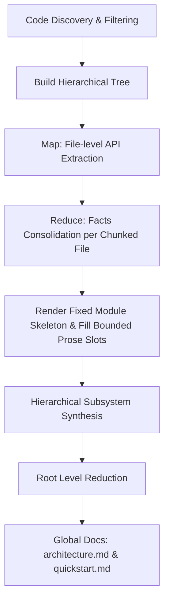

# Code-Reducer

**Code-Reducer** is a lightweight, high-performance command-line tool written in Go that automatically generates and maintains developer-friendly, comprehensive wikis for extensive repositories. 

Designed specifically for **local development and private LLMs**, Code-Reducer uses a custom **Hierarchical Map-Reduce Strategy** to analyze large codebases using small, local LLM models (e.g., 7B, 9B, or 26B parameters) via **Ollama** without exceeding context windows or degrading output quality.

---

## 🚀 Key Strengths

* **Hierarchical Map-Reduce Pipeline**: Breaks codebase synthesis into a structured Map-Reduce pipeline to document large directories recursively, staying strictly within local LLM context limits.
* **Optimized for Private & Local LLMs**: Built specifically to leverage Ollama (e.g., `ornith:9b` or `gemma4:26b`), eliminating expensive cloud API costs and keeping proprietary code local.
* **Deterministic Page Structure**: The engine writes every title, heading, heading order and component entry, and the model fills one bounded prose slot at a time, so page structure no longer depends on the model complying.
* **Fully Customizable Prompting System**: Allows overriding the default system prompt, the prose style of module and architecture pages, and the file fact consolidation rules directly from YAML configuration.
* **Enterprise-Grade Security Sandbox**: Features path traversal guards, atomic process locking, and TOCTOU symlink hijacking defenses for safe workspace operations.
* **Fast Incremental Updates**: Uses a filesystem SHA256 hash cache to only re-document modified files, propagating changes upward to minimize LLM calls.
* **Extraction Steps Cache Invalidation**: Automatically detects changes in your extraction steps pipeline and invalidates the cache to ensure documentation accuracy.

---

## 🏃 Quick Start

### Prerequisites
* **Go**: Version 1.26 or higher.
* **Ollama**: Running locally with a compatible model downloaded (e.g., `ornith:9b` or `gemma4:26b`).

### 1. Build from Source (or Download Release)
*Note: Precompiled binaries are available attached to each release.*

Compile the executable binary inside the repository root:
```bash
go build -o code-reducer main.go
```

### 2. Run the Tool (Implicit Setup)
If you run `code-reducer init` or `code-reducer update` in a terminal (TTY) and the `.code-reducer.yaml` configuration file does not exist, the interactive configuration wizard will launch automatically.

Alternatively, you can manually run the setup wizard first:
```bash
./code-reducer setup
```

### 3. Generate the Wiki
Initialize the documentation cache and build the initial markdown files:
```bash
./code-reducer init
```

### 4. Keep Docs Updated
Incrementally update the wiki whenever code files change:
```bash
./code-reducer update
```

---

## 🛠️ CLI Command Reference

### 1. `code-reducer setup`
Runs an interactive setup flow in the current directory to generate the `.code-reducer.yaml` configuration file. If a `.code-reducer.yaml` file already exists, all configuration prompts will default to its existing values. You will be prompted for:
* LLM Model ID (defaults to `ornith:9b`)
* Ollama Base URL (defaults to `http://localhost:11434`)
* Ollama Context Size (defaults to `8192`)
* Custom files and directories to ignore (comma-separated)
* Documentation output folder name (defaults to `wiki`)

Every key the wizard does not ask about (the prompts, the extraction steps, the generation budgets and `include_tests`) is carried through to the saved file unchanged.

### 2. `code-reducer init`
Scans the repository, builds the hierarchical tree, and generates the initial set of wiki markdown pages:
* Generates a metadata cache in `<docs_dir>/.metadata.json` containing the baseline metadata file summaries.
* Automatically generates (or appends to) an `AGENTS.md` file in the repository root to guide other AI development agents on how to find and use the generated wiki documentation.
* *Note: This command will implicitly launch the interactive setup wizard if the `.code-reducer.yaml` file is missing.*
* *Note: This command will fail if the project has already been initialized.*

### 3. `code-reducer update`
Detects files modified, added, or deleted since the last documentation run and performs an incremental documentation refresh:
* Computes SHA256 hashes of modified files and compares them with the `.metadata.json` cache to extract new technical facts only for files that actually changed.
* Rebuilds only the directory-level module summaries (`wiki/modules/<module>/README.md`) that correspond to changed files.
* Skips LLM calls for unchanged directories by reusing the cached summaries in `wiki/.metadata.json`.
* Bottom-up propagation: If a file inside a subdirectory changes, the subdirectory is marked "affected" and this state propagates up to the parent directory, rebuilding parents and the root summaries.
* Automatically syncs global files (`architecture.md` and `quickstart.md`) only if the root directory `.` is affected (i.e. top-level structural changes occurred) or if the files are physically missing.
* Cache Invalidation: Automatically detects changes in your `extraction_steps` configuration and invalidates the entire cache, forcing a full regeneration to ensure documentation accuracy.
* *Note: Like `init`, this command will implicitly launch the setup wizard if the configuration file is missing.*

---

## ⚙️ Configuration (`.code-reducer.yaml`)

Code-Reducer stores configuration parameters in a `.code-reducer.yaml` file in the root of the repository.

### Example Configuration:
```yaml
# The model ID loaded into your local Ollama instance
model_id: ornith:9b

# URL of the local or remote Ollama server
ollama_base_url: http://localhost:11434

# Custom context window size
ollama_num_ctx: 20000

# Ask the model for reasoning output. Required to be false for a reasoning model such
# as ornith:9b, which otherwise charges its hidden thinking against every generation
# budget: the same slot then costs 400 tokens instead of 34, and can return no content.
think: false

# Client-wide generation cap per LLM call. 0 lets Ollama decide. A value lower than
# a per-slot cap also caps that slot kind.
num_predict: 0

# Generation caps for the documentation prose slots, split by slot kind. The engine
# writes the page structure, so both are ceilings, not targets: a well-behaved slot
# returns far fewer tokens than allowed, and a generation that reaches one is
# salvaged down to its complete sentences instead of being written clipped.
# A line slot is trimmed by the code to its first sentence and to 40 words, so it
# only needs room for that sentence. A paragraph slot keeps everything it wrote.
# Measured with think: false, they cost 34 and 63 tokens.
slot_num_predict: 192
paragraph_num_predict: 1024

# Prompt payload budgeting: characters per token, and the context tokens held
# back from every prompt so generation always has room.
chars_per_token: 3.0
output_token_reserve: 1024

# Document test files as well. They are excluded by default because a test file
# is usually a restatement of its assertions, and each one costs a full
# extraction pass.
include_tests: false

# Target directory to write generated markdown documentation
docs_dir: wiki

# System instructions injected to every LLM request
system_prompt: |
    You are Code-Reducer, an expert technical writer and code analyzer. Your job is to strictly follow instructions. You do not yap, you do not write filler.
    DEFENSIVE RULES: 1. Do NOT use absolute terms ('always', 'never', 'zero') unless explicitly proven. 2. Do NOT guess downstream consequences or invent unhandled paths. If an error is swallowed, just say it is swallowed. 3. Do NOT name standard library packages unless explicitly stated in the source text. 4. Only report facts you are 100% sure about.

# Prose style applied to every slot of a directory module page. The engine owns
# the headings, their order and the component names, so this must never ask the
# model for structure.
module_synthesis_prompt: |-
    Task: Write the prose for one slot of a module documentation page.
    Rule 1: The headings, their order and the component names are already fixed by the tooling. Never emit headings, lists, code fences or any other structure.
    Rule 2: Answer with the requested slot text only, dense and technical, and keep it as short as the slot instruction asks.
    Rule 3: Use only the supplied facts, and say nothing about code you were not shown.

# Prose style applied to every section of the global architecture and quickstart pages
architecture_prompt: |-
    Task: Write the prose for one slot of a project documentation page (architecture or quickstart).
    Rule 1: The title, the headings and their order are already fixed by the tooling. Never emit headings, lists, code fences or any other structure.
    Rule 2: Answer with the requested slot text only, dense and developer-friendly, and keep it as short as the slot instruction asks.
    Rule 3: Use only the supplied module summaries, and never invent a module, a command or a workflow you were not shown.

# Prompt used to consolidate chunks of the same file
file_fact_consolidation_prompt: |-
    You are a specialized code documentation assistant.
    Consolidate, deduplicate and merge the following facts extracted from different chunks of the same file into a single, cohesive summary.

# Customize the LLM extraction pipeline steps
extraction_steps:
    - name: API_SIGNATURES
      prompt: |-
        Task: Extract the public API surface.
        Output: A strict Markdown list of all exported or public elements (classes, functions, methods, types). Include parameters and return types. Do not explain internal execution logic.
    - name: BUSINESS_LOGIC
      prompt: |-
        Task: Extract the core purpose and domain rules.
        Output: Explain the primary domain problem this code solves. List the high-level algorithm steps. Ignore syntax, standard library usage, and basic implementation details.
    - name: STATE_AND_CONCURRENCY
      prompt: |-
        Task: Identify mutable state and thread safety.
        Output: List global variables, shared states, or class-level properties that are modified. Identify synchronization mechanisms (locks, mutexes, async/await, atomic types). If entirely stateless, output exactly: 'No mutable state'.
    - name: ERRORS_AND_SIDE_EFFECTS
      prompt: |-
        Task: Analyze external I/O and error propagation.
        Output: Detail interactions with external systems (network, disk, databases, APIs). Explain how errors are propagated (exceptions, error return codes, crash/panic). If no I/O exists, state 'No external side effects'.

# Directory paths, files, or glob patterns to ignore during scanning
ignore:
  - README.md
  - .code-reducer.yaml
  - go.sum
  - go.mod
  - screenshots
  - examples
```

### Precedence Order
Code-Reducer implements a four-tier configuration resolution chain:

```
[1. CLI Overrides] ──► [2. Environment Variables] ──► [3. YAML Config File] ──► [4. System Defaults]
```

1. **CLI Flags**: Command-line arguments like `--model-id` and `--num-ctx` take absolute priority.
2. **Environment Variables**: Overrides config file values:
   * `CODE_REDUCER_MODEL_ID` overrides `model_id`
   * `OLLAMA_BASE_URL` overrides `ollama_base_url`
   * `OLLAMA_NUM_CTX` overrides `ollama_num_ctx`
   * `CODE_REDUCER_THINK` overrides `think`
   * `OLLAMA_NUM_PREDICT` overrides `num_predict`
   * `CODE_REDUCER_SLOT_NUM_PREDICT` overrides `slot_num_predict`
   * `CODE_REDUCER_PARAGRAPH_NUM_PREDICT` overrides `paragraph_num_predict`
   * `CODE_REDUCER_INCLUDE_TESTS` overrides `include_tests`
3. **YAML File (`.code-reducer.yaml`)**: Read from the repository root.
4. **Defaults**: Hardcoded fallbacks if no other configuration exists.

### Incomplete Output Is Never Written
Every call is bounded, and every incomplete answer is rejected instead of reaching a page. A generation that stopped on the generation limit (`done_reason: "length"`) is salvaged only when it left complete sentences: a one-line slot keeps its first complete sentence, and a paragraph slot keeps the text up to its last complete sentence. A run therefore aborts only when a slot answer holds no complete sentence at all, or when a fact extraction call is truncated, and then it aborts naming the call and the token counts without writing or caching anything. See [docs/configuration.md](docs/configuration.md) for the full table.

### Multi-language & Infrastructure Support
Code-Reducer can be configured to document not only software codebases but also Infrastructure-as-Code (IaC) or cloud topology. You can inspect an example config tailored for Terraform project analysis in [examples/terraform/.code-reducer.yaml](examples/terraform/.code-reducer.yaml).

---

## 🏗️ Architecture & Technical Deep Dive

### 1. Hierarchical Map-Reduce Engine


```mermaid
graph TD
    A[Code Discovery & Filtering] --> B[Build Hierarchical Tree]
    B --> C[Map: File-level API Extraction]
    C --> D[Reduce: Facts Consolidation per Chunked File]
    D --> E[Render Fixed Module Skeleton & Fill Bounded Prose Slots]
    E --> F[Hierarchical Subsystem Synthesis]
    F --> G[Root Level Reduction]
    G --> H[Global Docs: architecture.md & quickstart.md]
```

#### Tree Structure Construction
Code-Reducer groups scanned files into a logical directory hierarchy using a node prefix tree (`DirNode` containing children, files, and path values). Discovery drops test files by naming convention (`*_test.go`, `test_*.py`, `*.test.js`, `*Test.java`, `*Tests.cs`, `*_spec.rb`, `*_test.rs`, `*Tests.scala` and more) unless `include_tests: true` or `--include-tests` is set, because a documented test file is mostly a restatement of its assertions and costs a full extraction pass.

#### State Tracking & Change Propagation (`RunUpdate`)
In `update` mode, the engine dynamically determines which directory nodes are "affected" to avoid full-repository rebuilds. A directory is marked "affected" if:
* A file in its immediate files list has changed (detected via hash comparison).
* Its corresponding wiki module summary is missing from `wiki/modules/`.
* Its cached entry is missing from `.metadata.json` (as part of `MetadataCache.Modules`).
* **Propagation**: If a child directory is affected, the status propagates recursively upwards to the parent directory. This triggers a bottom-up rebuild of parent and root summaries.

#### Cache Invalidation on Extraction Steps Change
The metadata cache contains a `steps_hash` field representing the SHA256 of the configuration's `extraction_steps` array. During the `update` pipeline, the engine calculates the hash of the current extraction steps. If it differs from `cache.StepsHash`, it clears file facts and module caches, forcing a full regeneration. This ensures that when extraction requirements change, the entire documentation is safely updated.

#### The Map Phase (Dynamic Chunking with Overlap)
For every code file in an affected directory, the engine calculates the `SHA256` of its contents:
* **Cache Hit**: Reuses the stored facts string from the cache.
* **Cache Miss**: Analyzes the file using the configurable `extraction_steps` pipeline.
* **Llm Context-Based File Limits**: Large files are split into overlapping fragments. The engine budgets the payload from the context window: `output_token_reserve` tokens are held back for generation and the rest is converted into characters with `chars_per_token`. An overlap margin (defaults to 800 characters) is used to prevent context blindness at boundaries.
* Isolated inference is run on each chunk for each extraction step.
* **Prompt-Cache Friendly Layout**: The system message is always `system_prompt` and nothing else, so it is byte-identical on every call of a run and Ollama can reuse it (`prompt_eval_cached_count`). The per-step instruction rides in the user turn instead, after the file block, which keeps the shared prefix intact.

#### The Reduce Phase (Deterministic Skeleton & Bounded Prose Slots)
A module page is not written by the model. The engine renders the title, the section headings, their order, the component names and the component order, then fills each prose slot with one bounded micro-task:

```markdown
# Module: internal/engine

## Responsibility
<one line>

## Components

### File: client.go
<one line>

### Subsystem: config
<one line>

## Data Flow
<short paragraph>

## Error Handling
<short paragraph>
```

* **Minimal Context Per Slot**: The responsibility slot sees component identities only, a component slot sees only that component's facts, and the two paragraph slots see the identities plus a bounded per-component facts digest.
* **One Deterministic Line Per Line Slot**: A model asked for one line still answers with a bullet list or a rambling paragraph, so Go takes the first meaningful line (the item text when it is bulleted, otherwise the first sentence), bounds it to 40 words on a clause or word boundary, and drops the rest.
* **Parents Read Children as Identities**: A child subsystem reaches its parent as the head of its own page (title, responsibility, component entries), and a module with children is asked what flows *between* its components and how errors cross the boundary, instead of restating each child's interior. A leaf module keeps the per-component framing.
* **Bounded Per Slot**: Every slot passes its own `num_predict`, selected by slot kind (`slot_num_predict`, default `192`, for a one-line slot, `paragraph_num_predict`, default `1024`, for a paragraph slot), and a lower global `num_predict` wins for both. The defaults are sized on measurements taken with `think: false` (34 and 63 tokens), so `think: false` is required on a reasoning model such as `ornith:9b`: with thinking on, the same slots cost 400 and 795 tokens of which the tool never reads a word.
* **All-or-Nothing Pages**: A failing slot aborts the page, so nothing is written to disk and nothing is cached. A run aborts only when a slot answer holds no complete sentence to salvage, or when a fact extraction call is truncated.

#### Global Synthesis Phase
After the root directory (`.`) is reduced, its module page is used to generate:
1. **System Blueprint**: `wiki/architecture.md` (Overview, system boundaries, module interaction), built from the root module page.
2. **Developer Quickstart**: `wiki/quickstart.md` (What the project does, project layout, common workflows), built from the architecture page that was just generated rather than from the root page.
3. **AI Agent Guidelines**: During the initial initialization (`init`), the pipeline writes guidelines to `AGENTS.md` (or appends to it) to help other incoming agentic developers find and utilize the generated documentation.

---

### 2. Security & Concurrency Sandbox

The codebase enforces security when accessing local system paths and handling file writing operations.

#### Path Traversal Guard (`SafeResolve`)
Every filesystem operation targeting repository resources passes through `security.SafeResolve`.
1. **Directory Traversal Detection**: It computes the absolute path of the repository root, joins it with the input path, cleans it, and obtains the relative path.
2. **Sanity Check**: If the relative path starts with `..` or there is an error in resolving, it immediately returns a path traversal error, preventing any access to files outside the repository.

#### Atomic Process Locking (`security.AcquireLock`)
To serialize execution across multiple terminal windows or background jobs, the command engine invokes `security.AcquireLock` before starting the process:
1. **Atomic Lock Creation**: Opens `.code-reducer.lock` using the `os.O_WRONLY|os.O_CREATE|os.O_EXCL` flags. This guarantees that file creation is atomic at the OS level; if the lockfile already exists, the execution fails fast, preventing concurrent runs.
2. **PID Recording**: Writes the current Process ID (PID) to the lockfile.
3. **Git Isolation**: The runner automatically checks if `.code-reducer.lock` is ignored. If not, it safely appends it to the project's `.gitignore` file.

#### TOCTOU Symlink Hijacking & Safe File I/O
1. **Safe Reading (`ReadFileSafely`)**: When reading files, the engine resolves the target path using `security.SafeResolve`. `SafeResolve` prevents directory traversal by evaluating symlinks bottom-up on all existing ancestor directories before completing absolute path resolution, and aborts if the path escapes the repository boundary.
2. **Atomic Writing (`WriteFileSafely` & `SaveConfig`)**: To prevent data corruption, all file writes are performed atomically. The engine creates a temporary file in the target directory (`os.CreateTemp`), writes the contents, calls `Sync()` to flush to disk, closes the descriptor, sets the permissions, and atomically replaces the target file via `os.Rename`.

---

### 3. File Discovery and Ignore Filters

Repository scanning is executed using `filepath.WalkDir` coupled with multiple layers of evaluation:
1. **Pruning Subtrees**: Directories that are dot-prefixed (such as `.git` or `.venv`), end in `.egg-info`, or match any ignore rules (from `.gitignore` or configuration) are skipped entirely using `filepath.SkipDir` during traversal, saving CPU cycles.
2. **Ignore Matching Rules**: Ignores loaded from the project's `.gitignore` and specified in the YAML configuration are merged and compiled using a dedicated Gitignore library (`go-gitignore`), ensuring 100% compliance with standard Git semantic rules.

---

### 4. Git CLI and Hash-Based Incremental Rebuilds

Instead of relying on external Git diff parsing during runtime, Code-Reducer implements a robust Git verification step combined with a filesystem hash-based comparison engine:
* **`RunGit` Wrapper**: Executes `git` commands with the `--no-pager` option. It isolates `stdout` and `stderr` into separate streams, ensuring that Git warnings don't corrupt the actual command output used by the application.
* **Platform-Independent Change Detection**: The update engine discovers candidate source files on the filesystem, computes their `SHA256` hash, and compares them directly to the hashes persisted in the `.metadata.json` cache file.
* **State Classification**: 
  * **Added**: File is present in the workspace but missing from the cache.
  * **Modified**: File is present in both, but its current SHA256 does not match the cached hash.
  * **Deleted**: File exists in the cache but is missing from the workspace. Deleted files are automatically pruned from the cache.
* **Caching & Metadata Cache (`.metadata.json`)**: The metadata cache maps file paths to their `SHA256` and generated list of facts, alongside a map of directory modules. During updates, the engine matches active files against the cache and garbage-collects cache entries for deleted files.

---

### 5. LLM Client Contract & Transports

* **HTTP Request Timeout**: Configured to `10 minutes` to handle complex summarizations.
* **Ollama API Schema**: Communicates with the `/api/chat` POST endpoint.
* **Fail-Fast Client**: The LLM client is strictly fail-fast and does not perform retry attempts or exponential backoffs when calling the Ollama service. Any failure immediately returns an error.

---

## 📊 VRAM Resource Usage

Designed to run efficiently on local workstation GPUs, Code-Reducer maintains a low resource footprint. When generating its own wiki documentation under Ollama using the `ornith:9b` model with a `15K` (15,000) token context window, the dedicated VRAM usage stays at approximately **6.5 GB (6,476 MB)**. This makes it highly suitable for mainstream consumer-grade graphics cards (8GB or 12GB VRAM).

Below is a hardware performance snapshot captured during the documentation synthesis execution:


---

## 📂 Example Output

### CLI Execution Log

Here is an example of a successful Map-Reduce pipeline execution (`code-reducer init`):

```bash
$ code-reducer init
Starting Map-Reduce pipeline: init
Step 1: Code Discovery & Building Tree...
Step 2: Hierarchical Tree-Merging (Map-Reduce)...
➜ Extracting file (Step 1/4 - API_SIGNATURES): cmd/root.go
➜ Extracting file (Step 2/4 - BUSINESS_LOGIC): cmd/root.go
➜ Extracting file (Step 3/4 - STATE_AND_CONCURRENCY): cmd/root.go
➜ Extracting file (Step 4/4 - ERRORS_AND_SIDE_EFFECTS): cmd/root.go
➜ Assembling module page: cmd (4 total components)
➜ Describing responsibility of cmd
➜ Describing component File: init.go of cmd
➜ Describing component File: root.go of cmd
...
➜ Describing data flow of cmd
➜ Describing error handling of cmd
➜ Assembling module page: internal/config (3 total components)
...
➜ Assembling module page: . (3 total components)
➜ Describing responsibility of .
...
Step 3: Global Architecture Synthesis...
Step 4: Generating Quickstart...
Step 5: Updating AGENTS.md...
Pipeline completed successfully!
```

### Generated Documentation

You can inspect the actual documentation generated by Code-Reducer for this repository in the local [wiki/](wiki/) directory:

* **System Blueprint**: [wiki/architecture.md](wiki/architecture.md) – A high-level architectural overview of the system, module relations, and boundaries.
* **Developer Quickstart**: [wiki/quickstart.md](wiki/quickstart.md) – A quick onboarding guide with patterns, configuration rules, and setup steps.
* **Module Documentation**: Detailed technical specifications located in the [wiki/modules/](wiki/modules/) subdirectory:
  * [cmd/README.md](wiki/modules/cmd/README.md) – CLI commands (`root`, `setup`, `init`, `update`).
  * [internal/README.md](wiki/modules/internal/README.md) – Synthesis of core application library packages.
  * [internal/config/README.md](wiki/modules/internal/config/README.md) – Configuration engine and environment management details.
  * [internal/engine/README.md](wiki/modules/internal/engine/README.md) – Core Map-Reduce execution pipeline and LLM client logic.
  * [internal/security/README.md](wiki/modules/internal/security/README.md) – Path traversal checks and atomic lockfile-based process serialization.
  * [internal/tools/README.md](wiki/modules/internal/tools/README.md) – Helper utilities for Git integration and directory/binary discovery.

---

## 📄 License

This project is licensed under the MIT License. See [LICENSE](LICENSE) for details.
