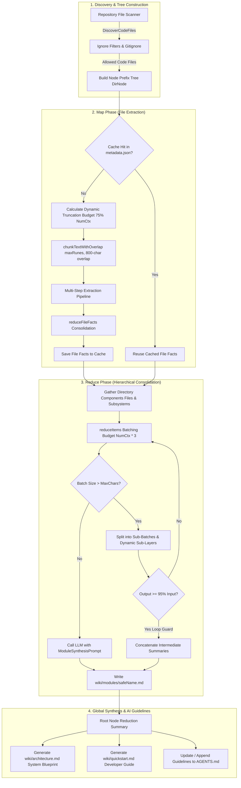

# Architecture & Map-Reduce Engine

Code-Reducer employs a multi-pass **Hierarchical Map-Reduce Strategy** engineered specifically to analyze large, multi-directory codebases using local small parameter LLMs (such as `ornith:9b` or `gemma4:26b`) hosted on [Ollama](https://ollama.com/).

By structuring codebase extraction into discrete, context-budgeted stages, Code-Reducer avoids context truncation, minimizes hallucination risk, and produces comprehensive developer documentation without relying on external cloud APIs.

---

## 🏗️ High-Level Map-Reduce Architecture



---

## 🌳 Node Prefix Tree (`DirNode`)

During repository discovery, Code-Reducer constructs an in-memory prefix tree representation of the codebase using the `DirNode` structure:

```go
type DirNode struct {
    Path     string
    Files    []string
    Children map[string]*DirNode
}
```

- **Path**: Virtual relative path of the directory node (e.g., `.` for repository root, `internal/engine` for subpackages).
- **Files**: Array of relative file paths contained directly within this directory.
- **Children**: Map of child directory names to their nested `*DirNode` structures.

This hierarchical tree enables recursive bottom-up synthesis: leaf directories are processed first, and their generated module summaries feed directly into parent node reductions.

---

## 🔍 The Map Phase (Dynamic File Extraction)

In the Map Phase, Code-Reducer iterates over source files within affected directories to extract core technical facts.

```
+-------------------------------------------------------------------------+
|                              Source File                                |
+-------------------------------------------------------------------------+
                                    |
                                    v
            +-----------------------------------------------+
            | Dynamic Truncation Budget (75% of NumCtx)    |
            | Overlap Margin: 800 characters                 |
            +-----------------------------------------------+
                                    |
            +-----------------------+-----------------------+
            |                                               |
            v                                               v
    +---------------+                               +---------------+
    | File Chunk 1  |                               | File Chunk 2  |
    +---------------+                               +---------------+
            |                                               |
            v                                               v
+-----------------------+                       +-----------------------+
| Extraction Pipeline   |                       | Extraction Pipeline   |
| 1. API_SIGNATURES     |                       | 1. API_SIGNATURES     |
| 2. BUSINESS_LOGIC     |                       | 2. BUSINESS_LOGIC     |
| 3. STATE_CONCURRENCY  |                       | 3. STATE_CONCURRENCY  |
| 4. ERRORS_SIDE_EFFECTS|                       | 4. ERRORS_SIDE_EFFECTS|
+-----------------------+                       +-----------------------+
            |                                               |
            +-----------------------+-----------------------+
                                    |
                                    v
                    +-------------------------------+
                    |   reduceFileFacts (Merge)     |
                    +-------------------------------+
                                    |
                                    v
                    +-------------------------------+
                    | Consolidated File Briefing    |
                    +-------------------------------+
```

### Context Allocation & Chunking Budget
To prevent context overflow, file chunking limits are dynamically calculated based on the LLM's context size `NumCtx`:

```go
numCtx := p.client.NumCtx()
if numCtx < minNumCtxFloor {
    numCtx = minNumCtxFloor
}
fileLimit := int(float64(numCtx * 4) * 0.75) // 75% of token context in characters
```

- **75% Budget Allocation (`contextWindowAllocRatio = 0.75`)**: Reserves 75% of `NumCtx` (assuming ~4 characters per token) for raw source content, leaving 25% reserved for system instructions, extraction prompts, and completion tokens.
- **800-Character Overlap Margin (`defaultChunkOverlap = 800`)**: Overlaps contiguous chunks by 800 characters to prevent boundary context loss (e.g. split function definitions or multiline comments).

### Multi-Step Extraction Pipeline
Each chunk is passed sequentially through configured `extraction_steps`:
1. `API_SIGNATURES`: Public interfaces, exported types, function parameters, and return types.
2. `BUSINESS_LOGIC`: Core domain problems solved and high-level algorithmic steps.
3. `STATE_AND_CONCURRENCY`: Global/shared mutable states, locks, mutexes, and atomics.
4. `ERRORS_AND_SIDE_EFFECTS`: External I/O (disk, network, database) and error propagation strategies.

Multi-chunk extractions for a single file are merged into a unified briefing via `reduceFileFacts`.

---

## ⚡ The Reduce Phase (Hierarchical Consolidation)

Once file-level facts are extracted, Code-Reducer consolidates directory components (file briefings and child subsystem summaries) into unified directory module documentation (`wiki/modules/<module>.md`).

### Batch Consolidation Budget (`NumCtx * 3`)
During reduction, batch character sizes are capped using `maxCharsMultiplier`:

$$\text{MaxChars} = \text{NumCtx} \times 3$$

If total component characters exceed $\text{MaxChars}$, components are grouped into smaller sub-batches and reduced independently.

### Dynamic Multi-Layer Map-Reduce (`reduceItems`)
When an individual item or sub-batch exceeds $\text{MaxChars}$, `reduceItems` automatically breaks the item into smaller chunks (`maxChars / 2` with `maxChars / 10` overlap) to introduce an additional reduction layer:

```go
for _, item := range items {
    if utf8.RuneCountInString(item) > maxChars {
        chunks, err := chunkTextWithOverlap(item, maxChars/2, maxChars/10)
        expanded = append(expanded, chunks...)
    } else {
        expanded = append(expanded, item)
    }
}
```

### Recursion Loop Prevention Guard
If an LLM fails to condense input text effectively (e.g., producing verbose output equal to or larger than input), naive recursive reduction would loop infinitely. Code-Reducer guards against this by measuring payload shrinkage:

```go
if totalOutputRunes >= (totalInputRunes * 95 / 100) {
    return strings.Join(intermediate, "\n\n"), nil
}
```

If total output character length is $\ge 95\%$ of input length, recursion halts and intermediate summaries are concatenated directly. Subsequent parent reductions safely handle chunking without data loss.

---

## 🌐 Global Synthesis Phase

After the root directory node (`.`) is synthesized, the orchestrator invokes `GenerateStandardDocs` to produce top-level project documentation:

1. **System Blueprint (`wiki/architecture.md`)**:
   Sent to the LLM with `architecture_prompt` to generate global system architecture, component interaction boundaries, and subsystem relationships.
2. **Developer Quickstart (`wiki/quickstart.md`)**:
   Generates onboarding workflows, environment setup, and development patterns based on root summary insights.
3. **AI Agent Guidelines (`AGENTS.md`)**:
   Creates or appends structured guidelines in `AGENTS.md` at the repository root:

```markdown
# AI Agent Guidelines

This repository contains automatically generated documentation under the wiki directory to help AI coding agents understand the system architecture, design patterns, and module structure:

- **System Blueprint**: Refer to wiki/architecture.md for a high-level system overview, module relationships, and boundary definitions.
- **Developer Quickstart**: Refer to wiki/quickstart.md for onboarding steps, coding patterns, and configuration settings.
- **Module Details**: Explore wiki/modules/ for directory-level summaries and API descriptions of internal packages.
```
