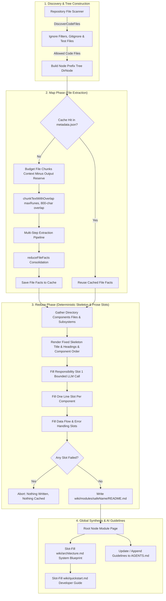

# Architecture & Map-Reduce Engine

Code-Reducer employs a multi-pass **Hierarchical Map-Reduce Strategy** engineered specifically to analyze large, multi-directory codebases using local small parameter LLMs (such as `ornith:9b` or `gemma4:26b`) hosted on [Ollama](https://ollama.com/).

By structuring codebase extraction into discrete, context-budgeted stages, Code-Reducer avoids context truncation, minimizes hallucination risk, and produces comprehensive developer documentation without relying on external cloud APIs.

---

## 🏗️ High-Level Map-Reduce Architecture


```mermaid
flowchart TD
    subgraph Discovery ["1. Discovery & Tree Construction"]
        A[Repository File Scanner] -->|DiscoverCodeFiles| B[Ignore Filters, Gitignore & Test Files]
        B -->|Allowed Code Files| C[Build Node Prefix Tree DirNode]
    end

    subgraph MapPhase ["2. Map Phase (File Extraction)"]
        C --> D{Cache Hit in metadata.json?}
        D -- Yes --> E[Reuse Cached File Facts]
        D -- No --> F[Budget File Chunks Context Minus Output Reserve]
        F --> G[chunkTextWithOverlap maxRunes, 800-char overlap]
        G --> H[Multi-Step Extraction Pipeline]
        H --> I[reduceFileFacts Consolidation]
        I --> J[Save File Facts to Cache]
    end

    subgraph ReducePhase ["3. Reduce Phase (Deterministic Skeleton & Prose Slots)"]
        J & E --> K[Gather Directory Components Files & Subsystems]
        K --> L[Render Fixed Skeleton Title & Headings & Component Order]
        L --> M[Fill Responsibility Slot 1 Bounded LLM Call]
        M --> N[Fill One Line Slot Per Component]
        N --> O[Fill Data Flow & Error Handling Slots]
        O --> P{Any Slot Failed?}
        P -- Yes --> Q[Abort: Nothing Written, Nothing Cached]
        P -- No --> R[Write wiki/modules/safeName/README.md]
    end

    subgraph SynthesisPhase ["4. Global Synthesis & AI Guidelines"]
        R --> S[Root Node Module Page]
        S --> T[Slot-Fill wiki/architecture.md System Blueprint]
        T --> U[Slot-Fill wiki/quickstart.md Developer Guide]
        S --> V[Update / Append Guidelines to AGENTS.md]
    end
```

---

## 🌳 Node Prefix Tree (`DirNode`)

During repository discovery, Code-Reducer constructs an in-memory prefix tree representation of the codebase using the `DirNode` structure:

```go
type DirNode struct {
    Path     string
    Files    []string
    Children map[string]*DirNode
}
```

- **Path**: Virtual relative path of the directory node (e.g., `.` for repository root, `internal/engine` for subpackages).
- **Files**: Array of relative file paths contained directly within this directory.
- **Children**: Map of child directory names to their nested `*DirNode` structures.

This hierarchical tree enables recursive bottom-up synthesis: leaf directories are processed first, and their generated module summaries feed directly into parent node reductions.

---

## 🔍 The Map Phase (Dynamic File Extraction)

In the Map Phase, Code-Reducer iterates over source files within affected directories to extract core technical facts.

```
+-------------------------------------------------------------------------+
|                              Source File                                |
+-------------------------------------------------------------------------+
                                     |
                                     v
             +-----------------------------------------------+
             | Output Reserve + Chars-Per-Token Budget      |
             | Overlap Margin: 800 characters                 |
             +-----------------------------------------------+
                                    |
            +-----------------------+-----------------------+
            |                                               |
            v                                               v
    +---------------+                               +---------------+
    | File Chunk 1  |                               | File Chunk 2  |
    +---------------+                               +---------------+
            |                                               |
            v                                               v
+-----------------------+                       +-----------------------+
| Extraction Pipeline   |                       | Extraction Pipeline   |
| 1. API_SIGNATURES     |                       | 1. API_SIGNATURES     |
| 2. BUSINESS_LOGIC     |                       | 2. BUSINESS_LOGIC     |
| 3. STATE_CONCURRENCY  |                       | 3. STATE_CONCURRENCY  |
| 4. ERRORS_SIDE_EFFECTS|                       | 4. ERRORS_SIDE_EFFECTS|
+-----------------------+                       +-----------------------+
            |                                               |
            +-----------------------+-----------------------+
                                    |
                                    v
                    +-------------------------------+
                    |   reduceFileFacts (Merge)     |
                    +-------------------------------+
                                    |
                                    v
                    +-------------------------------+
                    | Consolidated File Briefing    |
                    +-------------------------------+
```

### Context Allocation & Chunking Budget
To prevent context overflow, file chunking limits are dynamically calculated based on the LLM's context size `NumCtx`:

```go
// calculateFileLimit: the prompt budget is the context minus the output reserve,
// converted into characters with the measured characters-per-token ratio.
fileLimit := promptCharBudget(c.NumCtx(), cfg.OutputTokenReserve, cfg.CharsPerToken)
```

- **Output Reserve (`output_token_reserve`, default `1024` tokens)**: Held back from every prompt payload so the model always has room to generate, and reduced automatically if it is not smaller than the context.
- **Characters Per Token (`chars_per_token`, default `3.0`)**: The measured ratio for Go and Markdown payloads. With the defaults, a 20,000 token window gives a file payload of `(20000 - 1024) * 3.0` = 56,928 characters.
- **800-Character Overlap Margin (`defaultChunkOverlap = 800`)**: Overlaps contiguous chunks by 800 characters to prevent boundary context loss (e.g. split function definitions or multiline comments).

### Multi-Step Extraction Pipeline
Each chunk is passed sequentially through configured `extraction_steps`:
1. `API_SIGNATURES`: Public interfaces, exported types, function parameters, and return types.
2. `BUSINESS_LOGIC`: Core domain problems solved and high-level algorithmic steps.
3. `STATE_AND_CONCURRENCY`: Global/shared mutable states, locks, mutexes, and atomics.
4. `ERRORS_AND_SIDE_EFFECTS`: External I/O (disk, network, database) and error propagation strategies.

Multi-chunk extractions for a single file are merged into a unified briefing via `reduceFileFacts`.

### Cache-Friendly Message Layout
Ollama reuses the cached tokens of an unchanged prompt prefix and reports the reuse as `prompt_eval_cached_count`. Concatenating the per-step instruction onto `system_prompt` (`system = SystemPrompt + step.Prompt`) made every one of the four extraction steps a different system message, which broke the prefix on every call and drove the hit rate to 0%.

The system message is therefore byte-identical on **every** call of a run: it is always `system_prompt` and nothing else. Everything that varies per call - the extraction step instruction, the consolidation instruction, the prose style of a page kind, and the slot instruction with its context - is assembled into the user turn by `userMessage`:

```go
user := userMessage(
    fmt.Sprintf("File: %s inside Module: %s\n```\n%s\n```", name, nodePath, chunk),
    step.Prompt, // per-call instruction, last
)
res, err := p.client.CallLLM(ctx, p.cfg.SystemPrompt, []Message{{Role: "user", Content: user}}, false)
```

`userMessage` keeps the run-invariant parts first and the per-call text last, so the shared prefix of the user turn survives as well. Over the four extraction calls this restores a 12.5% hit rate, and the same layout is used for the consolidation, module-slot and standard-page calls.

---

## ⚡ The Reduce Phase (Deterministic Skeleton & Prose Slots)

Once file-level facts are extracted, Code-Reducer turns the directory components (file briefings and child subsystem summaries) into module documentation (`wiki/modules/<module>/README.md`).

The LLM is not asked to write a page. Measurements on a 9B model showed that a single free-form "write the module page" instruction complies with the requested headings only about half of the time, and that tightening the wording makes compliance *worse*, while a single-slot micro-task with a bounded one-line answer complies every time at a fraction of the tokens. Factual retention was unaffected in every variant: the model was never losing facts, it was failing at structure.

So the structure is the engine's job. `renderModulePage` writes the title, the section headings, their order, the component names and the component order verbatim, and each LLM call fills exactly one prose slot:

```markdown
# Module: internal/engine

## Responsibility
<one line>

## Components

### File: client.go
<one line>

### Subsystem: config
<one line>

## Data Flow
<short paragraph>

## Error Handling
<short paragraph>
```

### Minimal Context Per Slot
Slots receive only the context they need, so a module with many components never re-sends its whole subtree to every call:

| Slot | Kind | Context |
| :--- | :--- | :--- |
| Responsibility | one line | component identities only |
| Component line | one line | that single component's own facts |
| Data Flow | paragraph | component identities plus a bounded per-component facts digest |
| Error Handling | paragraph | component identities plus a bounded per-component facts digest |

`componentFactsDigest` splits `promptCharBudget` evenly across the components, and `truncateRunes` marks every cut so the model never reads a partial payload as the complete picture.

### Parents Read Their Children as Identities
A child subsystem reaches its parent as its rendered page, and a rendered page contains
a `## Data Flow` and an `## Error Handling` paragraph of its own. Feeding those to the
parent is what makes a parent page restate its children, so `childIdentityFacts` keeps
only the head of a child page (title, responsibility, component entries) and
`readComponents` uses it for every slot of the parent. The parent is then asked the
question only a parent can answer:

| Node shape | `## Data Flow` | `## Error Handling` |
| :--- | :--- | :--- |
| Has subsystem children | What flows between the components and what each hands to the next. | How errors cross the boundaries between the components and reach the caller. |
| Leaf (files only) | How data moves through the module. | How the module reports and handles errors. |

The framing is selected in Go from the node shape (`moduleShape`). It is not a config
knob, and a leaf module reads exactly the components it always did.

### One Deterministic Line Per Line Slot
A model asked for a single line still returns a bullet list, a heading, a fenced block
or an enumeration of every function in a file, so the shape of a line slot is decided
in Go rather than trusted to the model:

1. The first line that is not a fence or a heading is taken. A bulleted line keeps the
   item text, any other line is cut at its first sentence.
2. The result is bounded to 40 words, cut on the last sentence or clause boundary
   before that, and on a word boundary when the text offers none, so a word is never
   split.
3. Every remaining line is dropped. The heading and the structure around the line are
   already fixed by the page, so the tail is duplication.

### Hard Generation Bound Per Slot, Selected By Kind
Every slot call passes its own `num_predict` through `CallLLMWithNumPredict`, and the
bound is selected from the slot kind at call time. A one-line slot uses
`slot_num_predict` (default `192`): its answer is trimmed by the code to the first
sentence and to 40 words, so the bound only has to cover that first sentence, and
with `think: false` a measured one-line answer costs 34 tokens. A paragraph slot uses
`paragraph_num_predict` (default `1024`), because its answer is kept whole: with
`think: false` a measured paragraph costs 63 tokens. Both defaults are sized for a
non-thinking answer, which is what makes any sane slot budget possible at all:
`ornith:9b` is a reasoning model, and with `think: true` the same one-line slot costs
400 tokens and the same paragraph slot 795, almost all of it reasoning the tool never
reads and every token of it charged against the slot bound. Both bounds exist to stop a
chatty model from drifting back to the ~900 tokens a full-page generation costs. A user
who lowers the global `num_predict` below either bound wins, since `slotNumPredict` takes
the smaller of the two and never lets a global cap raise a per-slot one.

### Incomplete Output Never Reaches a Page
`requireCompleteContent` rejects any generation that stopped on `done_reason: "length"`
and any empty content, and every extraction call goes through it. A partial fact list
is misleading because it is the source of truth for the page it feeds, so it is a hard
failure.

Prose slots salvage a clipped answer before falling back to that hard failure, in the
slot layer only. A line slot keeps its first complete sentence and a paragraph slot
keeps the text up to its last complete sentence, because both prefixes are well-formed
instances of the contract the slot asked for; the call was bounded, so the salvage
costs no more tokens than the answer it replaces. An answer with no complete sentence
falls through to the hard failure, as does any other caller of
`requireCompleteContent`.

A page is all-or-nothing otherwise: a failing slot aborts it, so nothing is written to
disk and nothing is added to the module cache, and a partial page can never be
persisted or served from cache on the next run.

---

## 🌐 Global Synthesis Phase

After the root directory node (`.`) is synthesized, the orchestrator invokes `GenerateStandardDocs` to produce top-level project documentation:

1. **System Blueprint (`wiki/architecture.md`)**:
   `buildStandardDocPage` renders the fixed `Overview` / `System Boundaries` / `Module Interaction` skeleton and fills each section with one bounded call styled by `architecture_prompt`. The source of every section is the root module page produced by the reduce phase.
2. **Developer Quickstart (`wiki/quickstart.md`)**:
   The same treatment over a fixed `What This Project Does` / `Project Layout` / `Common Workflows` skeleton, so onboarding workflows, layout and development patterns each come from a single micro-task. Its source is the **architecture page that was just written**, not the root module summary: the two pages read different input, and each one is labelled with the source it was given (`Root module page:` versus `Architecture page:`).
3. **AI Agent Guidelines (`AGENTS.md`)**:
   Creates or appends structured guidelines in `AGENTS.md` at the repository root:

```markdown
# AI Agent Guidelines

This repository contains automatically generated documentation under the wiki directory to help AI coding agents understand the system architecture, design patterns, and module structure:

- **System Blueprint**: Refer to wiki/architecture.md for a high-level system overview, module relationships, and boundary definitions.
- **Developer Quickstart**: Refer to wiki/quickstart.md for onboarding steps, coding patterns, and configuration settings.
- **Module Details**: Explore wiki/modules/ for directory-level summaries and API descriptions of internal packages.
```
