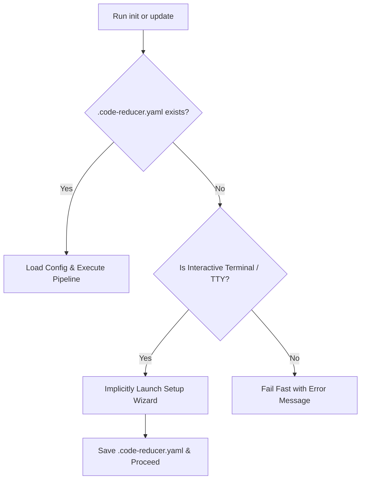

# CLI Commands & Setup Wizard

Code-Reducer provides a streamlined command-line interface (CLI) for configuring, initializing, and updating codebase wikis. This document details all CLI subcommands, interactive wizard behaviors, implicit setup detection, and command-line parameter overrides.

---

## CLI Subcommands Reference

Code-Reducer features three main subcommands:

```
code-reducer [subcommand] [flags]
```

### 1. `code-reducer setup`

Launches the interactive terminal setup wizard to create or update `.code-reducer.yaml`.

```bash
code-reducer setup
```

- **Purpose**: Interactively prompts for model selection, connection details, context window size, ignore patterns, and target documentation directory.
- **Behavior**: Reads existing `.code-reducer.yaml` if present and supplies current settings as prompt defaults.

---

### 2. `code-reducer init`

Generates the initial repository documentation set and metadata cache.

```bash
code-reducer init [--model-id <model>] [--num-ctx <size>]
```

- **Purpose**: Performs full codebase discovery, builds the hierarchical tree, extracts facts across files, and produces directory module summaries alongside root blueprints.
- **Artifacts Created**:
  - `<docs_dir>/` containing module documentation subdirectories.
  - `<docs_dir>/architecture.md` (System overview blueprint).
  - `<docs_dir>/quickstart.md` (Developer onboarding guide).
  - `<docs_dir>/.metadata.json` (SHA256 hash & facts cache).
  - `AGENTS.md` (Root AI agent navigation guide).
- **Constraints**: Fails fast if `<docs_dir>/.metadata.json` already exists. Use `update` for existing projects.

---

### 3. `code-reducer update`

Performs an incremental documentation update targeting only modified files and affected modules.

```bash
code-reducer update [--model-id <model>] [--num-ctx <size>]
```

- **Purpose**: Computes SHA256 hashes of current repository files, identifies modified, added, or deleted files against `<docs_dir>/.metadata.json`, and rebuilds only impacted modules.
- **Bottom-Up Propagation**: When a file changes, its parent directory module is rebuilt, propagating up the tree to refresh affected parent summaries.
- **Cache Invalidation**: Detects changes in `.code-reducer.yaml` extraction steps and automatically invalidates outdated file facts.
- **Constraints**: Fails fast if the project has not been initialized yet (`code-reducer init` required).

---

## Interactive Setup Wizard Flow

Running `code-reducer setup` initiates an interactive step-by-step terminal prompt flow:

```
Welcome to Code-Reducer CLI Setup
---------------------------------
Enter LLM Model ID [ornith:9b]: 
Enter Ollama Base URL [http://localhost:11434]: 
Enter Ollama Context Size [8192]: 20000
Enter directories, files, or patterns to ignore (comma-separated): screenshots, docs, examples
Enter documentation directory [wiki]: 
Configuration successfully saved to local .code-reducer.yaml file.
```

### Prompt Sequence & Defaults

1. **LLM Model ID**: Model loaded into local Ollama (Default: `ornith:9b`).
2. **Ollama Base URL**: API endpoint URL (Default: `http://localhost:11434`).
3. **Context Size (`num_ctx`)**: Context window in tokens (Default: `8192`).
4. **Ignore Patterns**: Comma-separated list of files or directories to ignore. Passing `clear` or `none` empties existing custom ignore lists.
5. **Documentation Directory**: Output directory for generated docs (Default: `wiki`).

If `.code-reducer.yaml` already exists when `setup` is executed, the wizard populates every prompt default using values from the existing YAML file.

---

## Implicit Wizard Launching

If you run `code-reducer init` or `code-reducer update` in a workspace where `.code-reducer.yaml` does not exist, Code-Reducer handles setup dynamically based on your terminal environment:



### Terminal (TTY) vs Non-Interactive (CI/CD)

- **Interactive TTY**: If stdin is attached to a terminal, Code-Reducer automatically pauses execution, runs `RunSetupFlow()`, writes `.code-reducer.yaml`, and seamlessly proceeds with `init` or `update`.
- **Non-TTY / CI Pipeline**: If stdin is detached (e.g. Docker build or GitHub Actions), Code-Reducer halts immediately with an error:

```
Error: configuration file .code-reducer.yaml does not exist in the current directory. Please run 'code-reducer setup' to configure the application
```

---

## Parameter Overrides via CLI Flags & Environment Variables

You can temporarily override configuration values without altering `.code-reducer.yaml`.

### CLI Persistent Flags

Code-Reducer accepts persistent flags on `init` and `update`:

| Flag | Type | Description | Example |
| :--- | :--- | :--- | :--- |
| `--model-id` | `string` | Override LLM model ID | `--model-id gemma4:26b` |
| `--num-ctx` | `string` | Override Ollama context window size | `--num-ctx 16384` |

#### Flag Examples

```bash
# Run initial analysis using a larger model and 16k context window
code-reducer init --model-id gemma4:26b --num-ctx 16384

# Run incremental update overriding only the model
code-reducer update --model-id ornith:9b
```

### Environment Variable Overrides

Environment variables override values in `.code-reducer.yaml` but yield to explicit CLI flags:

| Environment Variable | Target Parameter | Description |
| :--- | :--- | :--- |
| `CODE_REDUCER_MODEL_ID` | `model_id` | Overrides the LLM model ID. |
| `OLLAMA_BASE_URL` | `ollama_base_url` | Overrides the Ollama API server URL. |
| `OLLAMA_NUM_CTX` | `ollama_num_ctx` | Overrides the Ollama context window size. |

#### Environment Variable Examples

```bash
# Point to a remote Ollama server instance
export OLLAMA_BASE_URL="http://192.168.1.100:11434"
export CODE_REDUCER_MODEL_ID="gemma4:26b"
export OLLAMA_NUM_CTX=32768

code-reducer update
```
