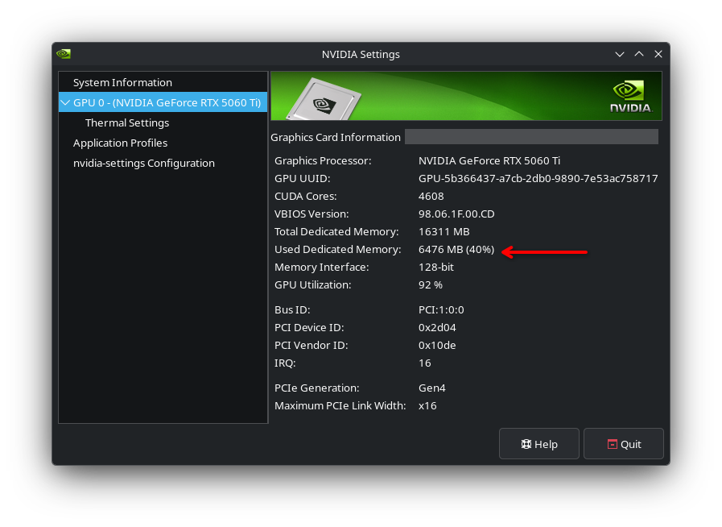

# Code-Reducer

  
  
  
  

Hierarchical Map-Reduce Wiki Generator for Local LLMs

---

## Key Features

  

    <i class="fa-solid fa-sitemap feature-icon"></i>
    <h3>Hierarchical Map-Reduce Pipeline</h3>
    
Recursively breaks codebase synthesis into structured Map and Reduce phases to document arbitrary repo sizes within strict context limits.

  

  

    <i class="fa-solid fa-user-shield feature-icon"></i>
    <h3>Private & Local LLMs</h3>
    
Zero cloud dependencies or API costs. Leverages local Ollama instances (e.g. <code>ornith:9b</code>, <code>gemma4:26b</code>) to keep code private.

  

  

    <i class="fa-solid fa-sliders feature-icon"></i>
    <h3>Fully Customizable Prompting</h3>
    
Tailor extraction steps, system prompts, module synthesis blueprints, and file fact consolidation rules directly via <code>.code-reducer.yaml</code>.

  

  

    <i class="fa-solid fa-lock feature-icon"></i>
    <h3>Enterprise Security Sandbox</h3>
    
Hardened filesystem guards featuring bottom-up symlink traversal checks, atomic process locking, and TOCTOU-safe atomic file writing.

  

  

    <i class="fa-solid fa-bolt feature-icon"></i>
    <h3>Fast Incremental Updates</h3>
    
Uses SHA256 file hashing against <code>.metadata.json</code> to only re-process changed files and propagate updates bottom-up through the module tree.

  

  

    <i class="fa-solid fa-rotate feature-icon"></i>
    <h3>Cache Invalidation</h3>
    
Automatically tracks extraction pipeline schema changes via <code>steps_hash</code> to safely force full documentation regeneration when prompts evolve.

  

---

## Resource Efficiency & VRAM Footprint

Designed specifically for developer workstations and local GPU acceleration, **Code-Reducer** operates efficiently within consumer hardware constraints. Operating with a 15,000 token context window (`15K`) under Ollama, VRAM consumption remains stable at approximately **6.5 GB**:

---

## Documentation Index

Explore the documentation guides below to learn more about Code-Reducer's design, configuration, and workflows:

  <a href="architecture.md" class="feature-card">
    <i class="fa-solid fa-cubes feature-icon"></i>
    <h3>Architecture & Map-Reduce Engine</h3>
    
Deep dive into node prefix trees (<code>DirNode</code>), dynamic file chunking, sub-batch reduction, and global synthesis phases.

  </a>
  <a href="map-reduce-caching.md" class="feature-card">
    <i class="fa-solid fa-database feature-icon"></i>
    <h3>Incremental Updates & Caching</h3>
    
Learn how SHA256 state tracking, bottom-up change propagation, and <code>steps_hash</code> invalidation minimize LLM calls.

  </a>
  <a href="security-concurrency.md" class="feature-card">
    <i class="fa-solid fa-shield-halved feature-icon"></i>
    <h3>Security Sandbox & Concurrency</h3>
    
Understand <code>SafeResolve</code> traversal guards, atomic process locking with <code>O_EXCL</code>, and TOCTOU symlink protection.

  </a>
  <a href="configuration.md" class="feature-card">
    <i class="fa-solid fa-gears feature-icon"></i>
    <h3>Configuration & Prompts</h3>
    
Complete reference for <code>.code-reducer.yaml</code>, environment variable overrides, ignore filters, and extraction pipelines.

  </a>
  <a href="cli-wizard.md" class="feature-card">
    <i class="fa-solid fa-terminal feature-icon"></i>
    <h3>CLI Commands & Setup Wizard</h3>
    
Guide to <code>setup</code>, <code>init</code>, and <code>update</code> commands, interactive prompts, and terminal execution workflows.

  </a>
  <a href="performance-vram.md" class="feature-card">
    <i class="fa-solid fa-microchip feature-icon"></i>
    <h3>Performance & VRAM Usage</h3>
    
VRAM benchmarking, context window budgeting metrics, multi-pass reduction throughput, and hardware recommendations.

  </a>
  <a href="installation.md" class="feature-card">
    <i class="fa-solid fa-download feature-icon"></i>
    <h3>Installation & Building</h3>
    
Step-by-step instructions for building Code-Reducer from source using Go 1.26+, binary installation, and Ollama integration.

  </a>

