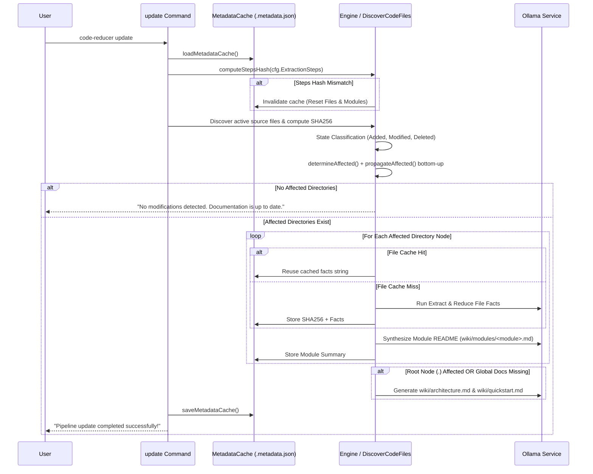

# Incremental Updates & Map-Reduce Caching

To avoid re-analyzing an entire codebase every time a minor file changes, **Code-Reducer** implements a lightweight, platform-independent caching engine backed by filesystem SHA256 content hashing and state propagation.

Running `code-reducer update` selectively re-processes only modified source files and affected directory modules, reducing execution time and LLM inference overhead by up to 95% on typical incremental updates.

---

## ⚡ Incremental Workflow (`code-reducer update`)

When `code-reducer update` is executed, the pipeline performs the following sequence:



---

## 🔑 Hash-Based State Tracking (`.metadata.json`)

Documentation cache state is persisted inside the designated output folder (e.g. `wiki/.metadata.json`).

### Metadata Cache Schema

```json
{
  "version": 1,
  "steps_hash": "a5d8f7b3c2e1...",
  "files": {
    "internal/engine/orchestrator.go": {
      "sha256": "e3b0c44298fc1c149afbf4c8996fb92427ae41e4649b934ca495991b7852b855",
      "facts": "#### [API_SIGNATURES]\n..."
    }
  },
  "modules": {
    "internal/engine": "Synthesized module summary markdown content..."
  }
}
```

### Platform-Independent SHA256 Content Hashing
File change detection relies on direct binary content SHA256 computation rather than operating system modification timestamps (`mtime`) or Git commit history:

```go
func computeSHA256(repoRoot, virtualPath string) (string, error) {
    content, err := tools.ReadFileSafely(repoRoot, virtualPath)
    if err != nil {
        return "", err
    }
    hash := sha256.Sum256(content)
    return hex.EncodeToString(hash[:]), nil
}
```

This guarantees identical behavior across operating systems (Linux, macOS, Windows) and avoids invalidating caches when files are checked out or touched without content modifications.

---

## 📊 File State Classification

During `detectFileChanges`, active repository files discovered by `DiscoverCodeFiles` are compared against `cache.Files`:

| Classification | Condition | Action Taken |
| :--- | :--- | :--- |
| **`Added`** | Present in workspace, missing from `cache.Files`. | Directory containing file marked **affected**. Full Map extraction triggered for file. |
| **`Modified`** | Present in both workspace and cache, but current SHA256 $\neq$ cached SHA256. | Directory marked **affected**. Fact cache invalidated for file; full extraction re-run. |
| **`Deleted`** | Present in `cache.Files`, missing from active workspace. | Immediate parent directory marked **affected**. Cache entry pruned from `cache.Files`. |

---

## 🌲 Bottom-Up Change Propagation

When source files change deep inside a project subfolder, child module changes must reflect in parent module documentation. Code-Reducer achieves this through two-phase affect determination:

### 1. Direct Affect Evaluation (`determineAffected`)
A directory node `n` is directly marked **affected** if:
- Any file in `n.Files` has a `Modified` or `Added` status.
- Any file associated with `n.Path` was `Deleted`.
- The directory's module documentation file (`wiki/modules/<module>.md`) is physically missing on disk.
- The directory entry `cache.Modules[n.Path]` is missing.

### 2. Recursive Bottom-Up Propagation (`propagateAffected`)
Once direct affects are identified, `propagateAffected` performs a post-order traversal up the tree:

```go
func propagateAffected(node *DirNode, affectedDirs map[string]bool) map[string]bool {
    newAffected := make(map[string]bool)
    for k, v := range affectedDirs {
        newAffected[k] = v
    }

    var propagate func(*DirNode) bool
    propagate = func(n *DirNode) bool {
        isAffected := newAffected[n.Path]
        for _, child := range n.Children {
            if propagate(child) {
                isAffected = true
            }
        }
        if isAffected {
            newAffected[n.Path] = true
        }
        return isAffected
    }
    propagate(node)
    return newAffected
}
```

If `internal/engine/chunking.go` changes:
1. `internal/engine` is marked directly affected.
2. Propagation marks `internal` affected.
3. Propagation marks `.` (root) affected.
4. Leaf nodes outside `internal` (e.g. `cmd/`) remain **unaffected** and reuse cached summaries.

---

## 🔄 Extraction Steps Cache Invalidation (`steps_hash`)

If a developer customizes or updates the `extraction_steps` array in `.code-reducer.yaml` (e.g. adding a security analysis step or altering extraction prompts), existing cached facts become stale.

Code-Reducer tracks prompt evolution by computing a SHA256 digest of the serialized extraction steps array:

```go
func computeStepsHash(steps []config.ExtractionStep) string {
    data, err := json.Marshal(steps)
    if err != nil {
        return ""
    }
    h := sha256.Sum256(data)
    return hex.EncodeToString(h[:])
}
```

During `code-reducer update`:
1. `currentStepsHash` is calculated from active configuration.
2. If `cache.StepsHash != currentStepsHash`:
   - A warning event is logged: `"Warning: Extraction steps changed. Invalidating metadata cache to force full documentation regeneration."`
   - `cache.Files` and `cache.Modules` are cleared in memory.
   - `cache.StepsHash` is updated to `currentStepsHash`.
3. All files and directories are marked affected, forcing a clean, safe rebuild of the entire documentation suite.
