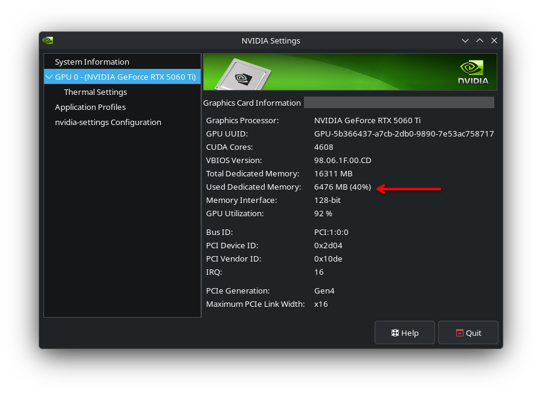

# Performance & VRAM Resource Allocation

Code-Reducer is designed specifically to execute locally alongside lightweight, open-weight LLMs via **Ollama**. This document breaks down VRAM memory consumption, context window budgeting strategies, embedded hardware benchmarks, and practical recommendations for consumer GPUs.

---

## VRAM Resource Footprint Analysis

Unlike heavy Python frameworks or containerized AI pipelines, Code-Reducer is written in pure Go. Memory management and process scheduling are handled directly by the OS, leaving system RAM and VRAM dedicated entirely to Ollama inference.

### Footprint Snapshot (~6.5 GB VRAM)

When processing standard codebases using a 9B parameter model (such as `ornith:9b`) configured with a **15,000 to 20,000 token context window**, Code-Reducer maintains a total GPU VRAM footprint of approximately **6.5 GB (6,476 MB)**.



This low VRAM footprint enables developers to execute high-density Map-Reduce documentation synthesis on standard workstation hardware without requiring enterprise cloud GPUs (such as A100 or H100 cards).

---

## Context Window Budgeting Strategy

To prevent context truncation, out-of-memory (OOM) errors, or prompt degradation during file processing, Code-Reducer reserves part of the context for generation and budgets the rest in characters.

```
┌─────────────────────────────────────────────────────────┐
│               Total Context Window (NumCtx)             │
├───────────────────────────────────┬─────────────────────┤
│ Source File Payload               │ Output Reserve      │
│ (NumCtx - reserve) * chars/token  │ (1024 tokens)       │
└───────────────────────────────────┴─────────────────────┘
```

### 1. Dynamic File Chunking (Map Stage)

For source files that exceed the available budget:

1. **Output Reserve**: `output_token_reserve` (default `1024` tokens) is held back from every prompt payload so generation always has room.
2. **Character Ratio**: `chars_per_token` (default `3.0`) is the measured characters-per-token ratio for Go and Markdown payloads.
3. **Payload Limit**: The chunk payload limit is `chars_per_token * (NumCtx - output_token_reserve)`. For an 8,192 token window with the defaults that is `3.0 * (8192 - 1024)` = 21,504 characters.
4. **Context Boundary Overlap**: Each chunk includes an **800-character overlap margin** relative to the preceding chunk, preserving variable definitions, scopes, and comment context across chunk boundaries.

### 2. Fact Consolidation (Map Stage)

When one file is split into several chunks, the facts of each extraction step are
consolidated back into one briefing per step:

- Items are merged into batches capped at the same character budget.
- If a single batch exceeds the limit, Code-Reducer splits it into sub-batches and applies multi-layer recursive reduction.
- To prevent infinite reduction loops (e.g. if an LLM fails to compress input text), the engine tracks input vs output size reduction ratios and gracefully terminates recursion before memory limits are breached.

### 3. Documentation Slots (Reduce Stage)

A module page is not generated as a payload of prose. The engine writes the headings and
sends one bounded micro-task per prose slot, so the only payload a reduce step ever
assembles is a component facts digest sized to the same budget, and every generation is
capped by the cap of its slot kind: `slot_num_predict` (default `192`) for a one-line
slot and `paragraph_num_predict` (default `1024`) for a paragraph slot. Both defaults
are sized for a non-thinking answer, since a reasoning model charges its hidden
thinking against the same cap: measured with `think: false` a one-line slot costs 34
tokens and a paragraph slot 63, while with thinking enabled they cost 400 and 795.

---

## Hardware Recommendations for Consumer GPUs

Code-Reducer operates efficiently across a broad range of consumer graphics cards:

| GPU Class | VRAM Size | Recommended Model | Max `ollama_num_ctx` | Expected Footprint |
| :--- | :--- | :--- | :--- | :--- |
| **Entry Level** | 8 GB | `ornith:9b` (Q4_K_M) | `8192` - `12000` | ~5.8 - 6.8 GB |
| **Mid Range** | 12 GB | `ornith:9b` / `gemma4:26b` | `16384` - `24000` | ~6.5 - 9.5 GB |
| **High End** | 16 GB - 24 GB | `gemma4:26b` | `32768`+ | ~11.0 - 18.0 GB |

### GPU Optimization Guidelines

#### 8 GB VRAM Cards (e.g., RTX 3060 8GB, RTX 4060 8GB)
- Keep `ollama_num_ctx` between `8192` and `12000`.
- Close VRAM-heavy applications (browsers with hardware acceleration, video editors) prior to running initial repository scans (`code-reducer init`).

#### 12 GB VRAM Cards (e.g., RTX 3060 12GB, RTX 4070 12GB)
- Recommended setting: `ollama_num_ctx: 20000` with `ornith:9b`.
- Delivers optimal balance between Map-Reduce batch density and inference speed.

#### 16 GB+ VRAM Cards (e.g., RTX 4080, RX 7900 XT)
- Allows leveraging larger parameter models like `gemma4:26b` with context windows up to `32768` tokens, enabling fewer reduction passes on large repositories.
